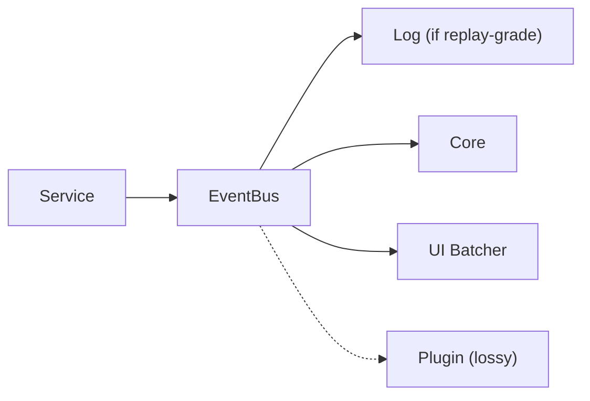
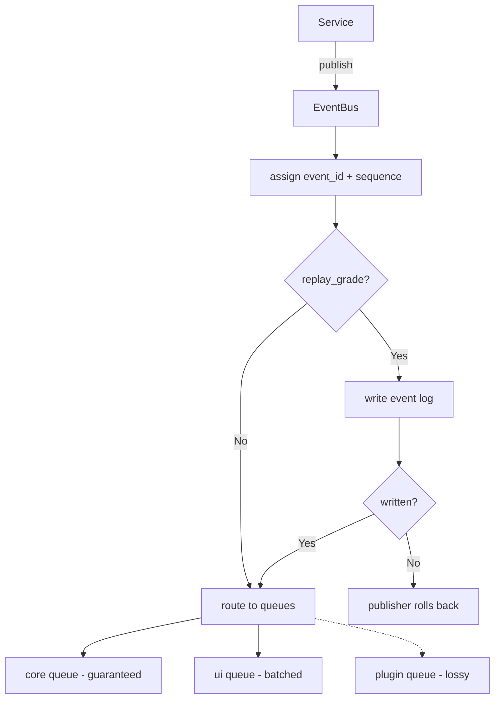
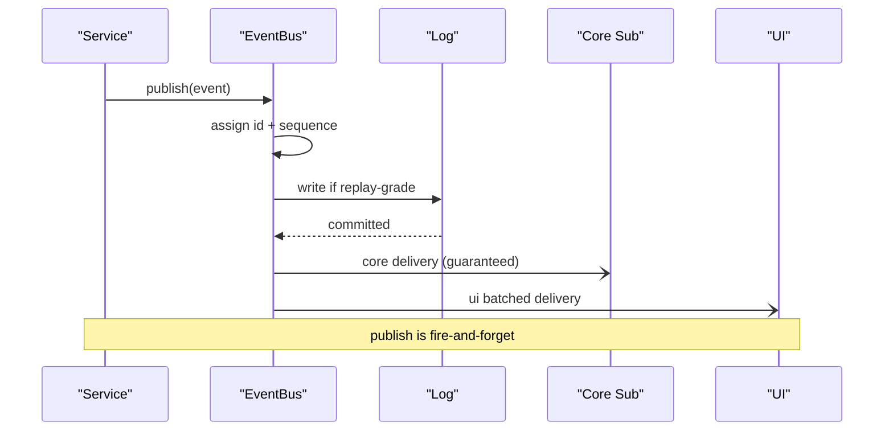
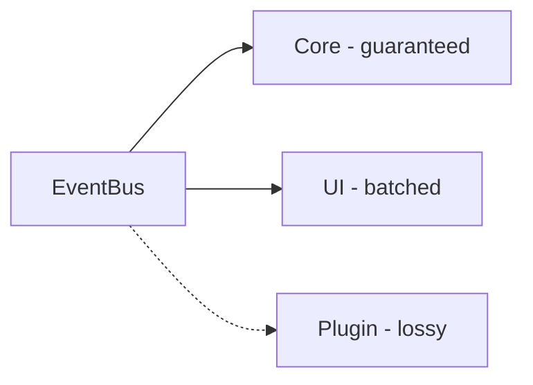
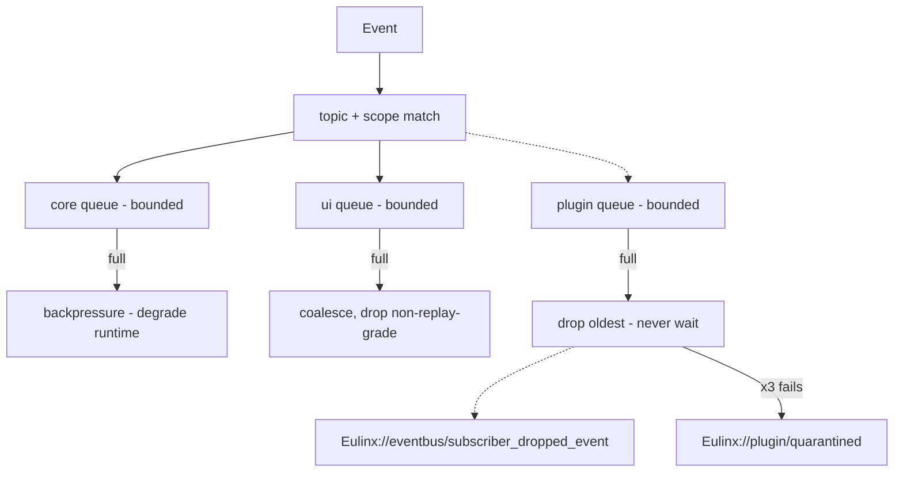
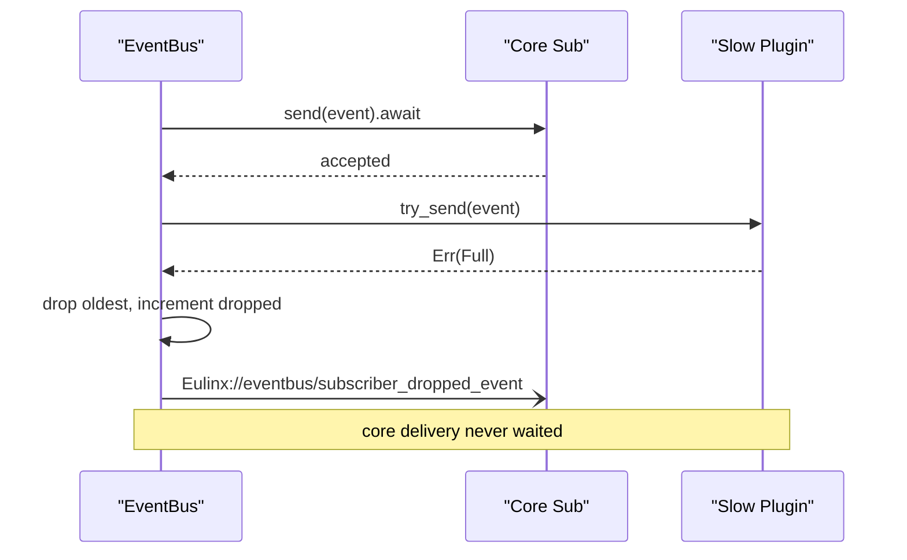
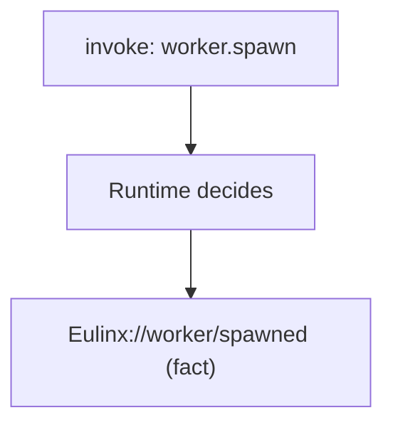
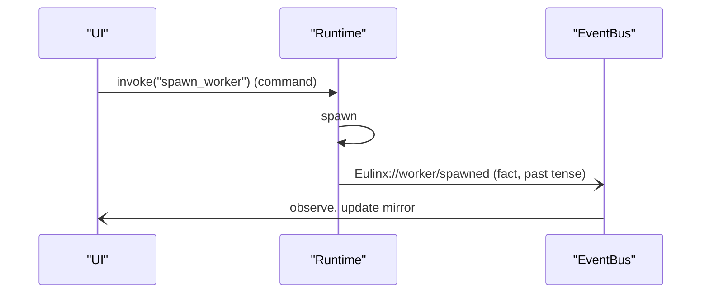

---
title: EventAPI Diagrams
status: draft
version: 1.0
tags:
  - api
  - event-api
  - diagrams
related:
  - "[[EventAPI-Part01]]"
  - "[[EventAPI-Part02]]"
  - "[[EventAPI-Part03]]"
  - "[[EventAPI-Part04]]"
  - "[[EventAPI-Part05]]"
  - "[[15-api/README]]"
  - "[[EventBus-Diagrams]]"
  - "[[IPC-Diagrams]]"
---

# EventAPI Diagrams

Every flow below is rendered as overview mermaid, detailed mermaid, ASCII, and sequence.

## Event Lifecycle

### Overview



### Detailed



### ASCII

```text
Service.publish(event)
   |
   +-- assign event_id + monotonic sequence
   +-- if replay_grade: WRITE LOG (before delivery)
   |     write failed -> publisher rolls back, do not deliver
   |
   +-- route:
        core queue   -> guaranteed (backpressure)
        ui queue     -> coalesced, batched
        plugin queue -> lossy (never blocks core)
   |
   v
subscribers react (no return value, no Runtime mutation)
```

### Sequence



## Delivery Classes

### Overview



### Detailed



### ASCII

```text
Class    Replay-grade   High-frequency   Blocks publisher?
------   ------------   -------------   -----------------
core     never dropped  never dropped    yes (backpressure)
ui       never dropped  may drop/coalesce no
plugin   may drop       may drop         no, ever

plugin overflow -> drop oldest -> Eulinx://eventbus/subscriber_dropped_event
plugin x3 fails -> Eulinx://plugin/quarantined
```

### Sequence



## Facts Not Commands

### Overview



### ASCII

```text
WRONG (control channel):
  emit Eulinx://worker/spawn  -> subscriber tries to spawn -> bus is now a command channel

RIGHT (fact broadcast):
  invoke("spawn_worker")  -> Runtime spawns
  Runtime -> publish Eulinx://worker/spawned  -> subscribers observe
```

### Sequence



## Related Documents

- [[EventAPI-Part01]]
- [[EventAPI-Part02]]
- [[EventAPI-Part03]]
- [[EventAPI-Part04]]
- [[EventAPI-Part05]]
- [[15-api/README]]
- [[EventBus-Diagrams]]
- [[IPC-Diagrams]]
- [[Contracts-Part02]]
