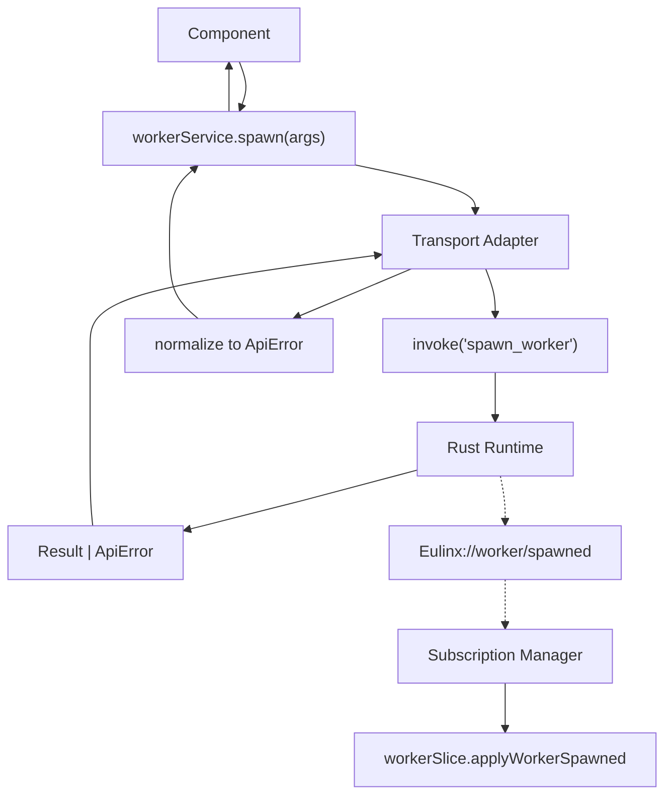
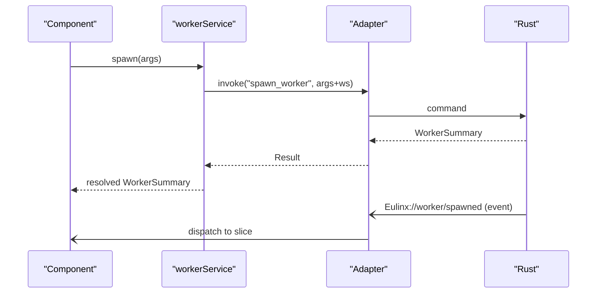
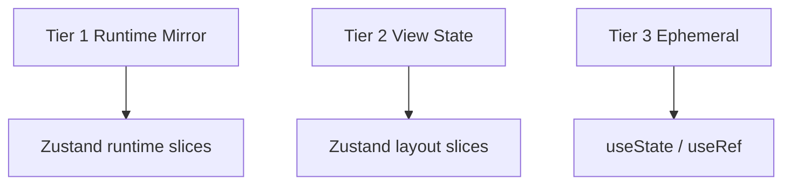
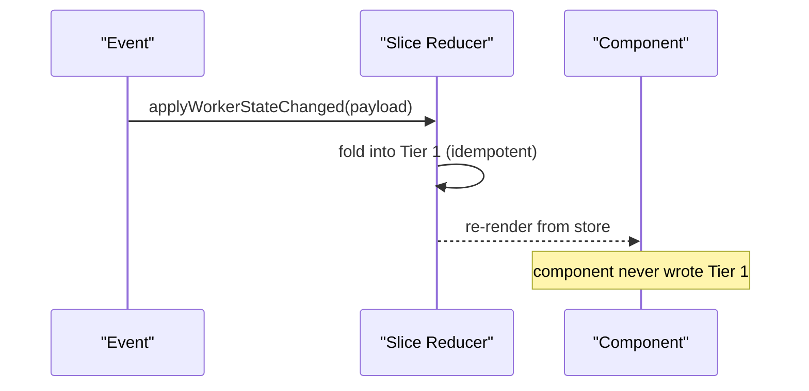
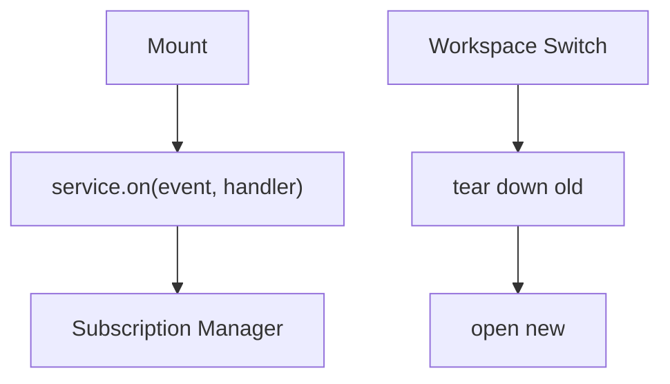
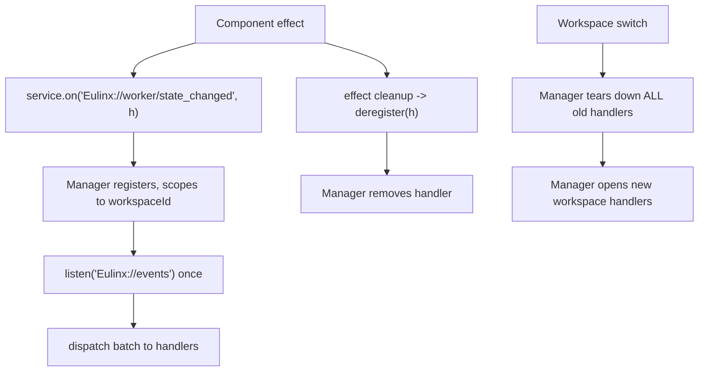
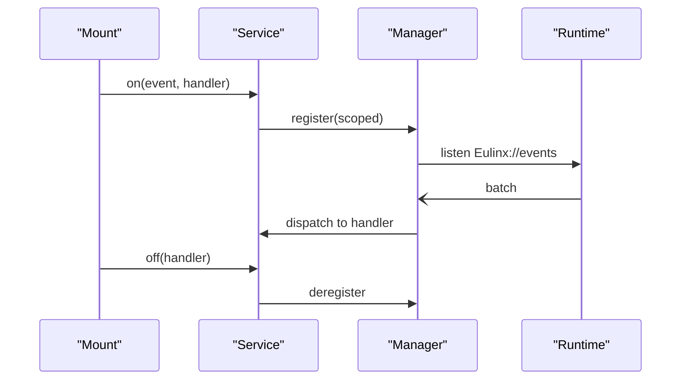

---
title: FrontendAPI Diagrams
status: draft
version: 1.0
tags:
  - api
  - frontend-api
  - diagrams
related:
  - "[[FrontendAPI-Part01]]"
  - "[[FrontendAPI-Part02]]"
  - "[[FrontendAPI-Part03]]"
  - "[[FrontendAPI-Part04]]"
  - "[[FrontendAPI-Part05]]"
  - "[[15-api/README]]"
  - "[[IPC-Diagrams]]"
---

# FrontendAPI Diagrams

Every flow below is rendered as overview mermaid, detailed mermaid, ASCII, and sequence.

## Service Module to Runtime

### Overview


### Detailed



### ASCII

```text
Component
   |
   v
workerService.spawn({prompt, refinementMode})
   |
   v
Transport Adapter  (ONLY file that calls invoke)
   |  - inject workspaceId
   |  - invoke("spawn_worker")
   v
Rust Runtime -> Result | ApiError
   |
   v
Adapter normalizes rejection -> ApiError {code, message, context}
   |
   v
workerService resolves / rejects
   |
   v
Component awaits

Later (async):
Runtime -> EventBus -> Eulinx://worker/spawned
   |
   v
Subscription Manager -> workerSlice.applyWorkerSpawned
   |
   v
Runtime mirror updated (Tier 1)
```

### Sequence



## State Tiers

### Overview



### ASCII

```text
TIER 1  Runtime Mirror   owner: backend   written by: events + command results
        lives in: Zustand runtime slices
        Workers, Sessions, Executions, Artifacts, Graph, Locks, Permissions

TIER 2  View State       owner: frontend, persisted
        lives in: Zustand layout slices -> SQLite (debounced)
        pane sizes, active tab, zoom, theme, node positions

TIER 3  Ephemeral        owner: component
        lives in: useState / useRef
        hover, drag, selection, open menu, unsaved input
```

### Sequence



## Subscription Lifecycle

### Overview



### Detailed



### ASCII

```text
mount:
  useEffect(() => {
    const off = workerService.onStateChanged(h)
    return () => off()         // always
  })

workspace switch:
  Manager.tearDown(oldWs)   // all handlers + listen
  Store.reset(newWs)
  Manager.open(newWs)

wrong: listen in render, no cleanup -> double-apply after switch
```

### Sequence



## Related Documents

- [[FrontendAPI-Part01]]
- [[FrontendAPI-Part02]]
- [[FrontendAPI-Part03]]
- [[FrontendAPI-Part04]]
- [[FrontendAPI-Part05]]
- [[15-api/README]]
- [[IPC-Diagrams]]
