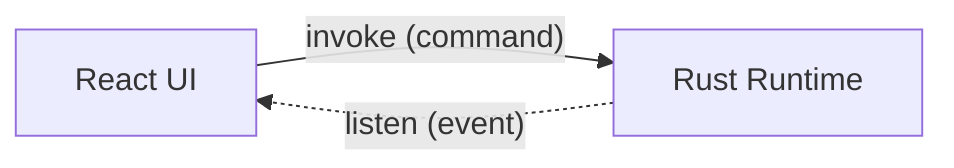
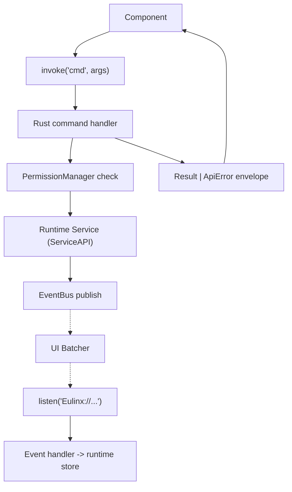
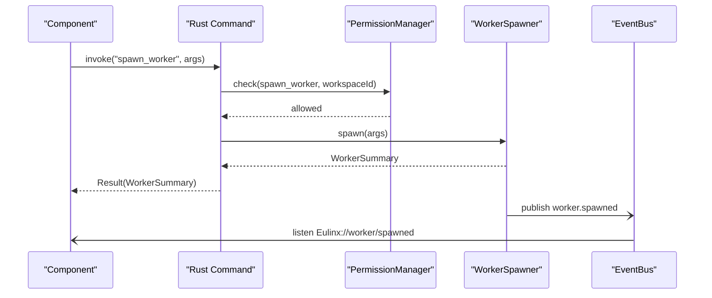
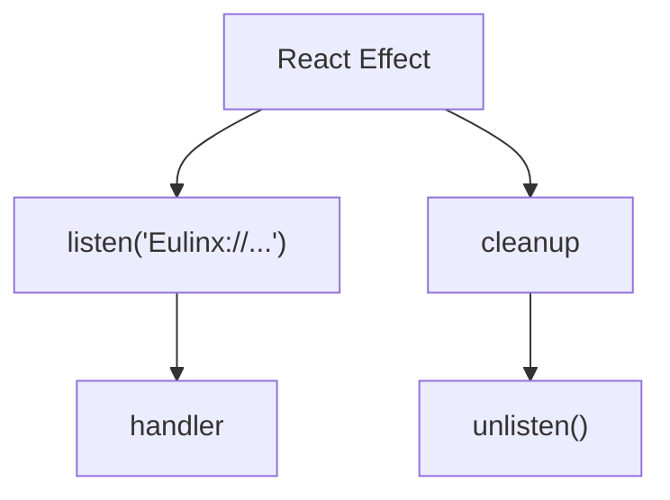
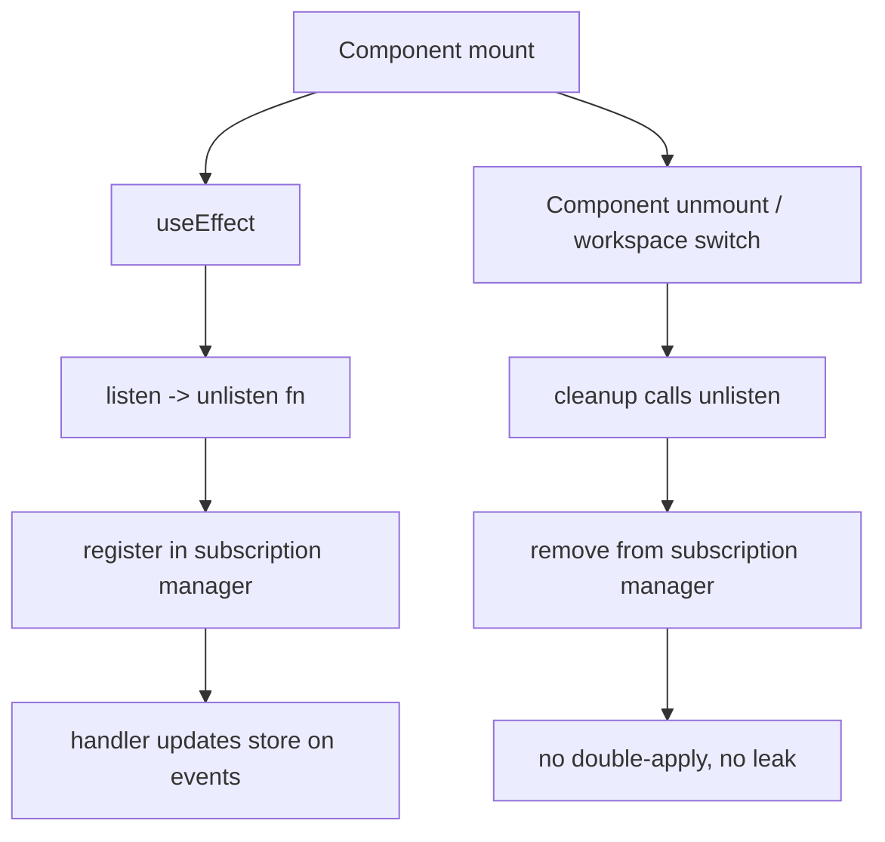
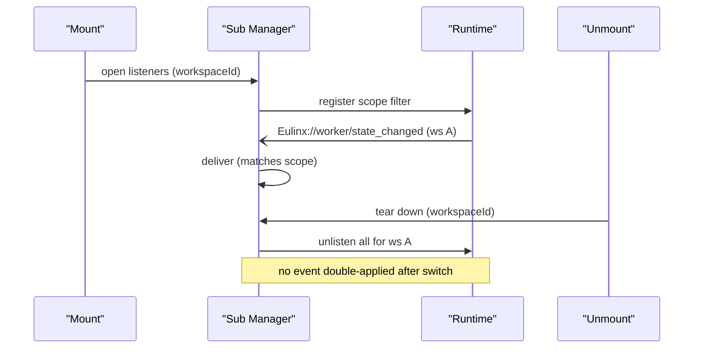
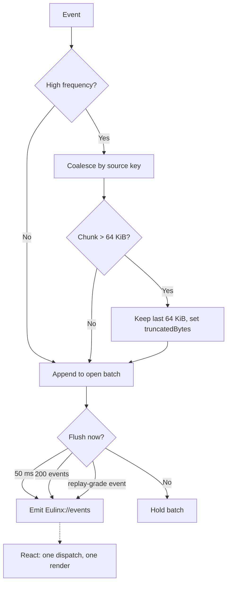
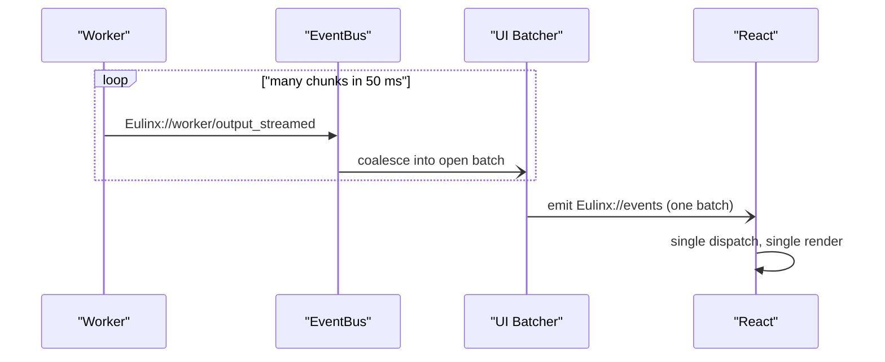

---
title: IPC Diagrams
status: draft
version: 1.0
tags:
  - api
  - ipc
  - diagrams
related:
  - "[[IPC-Part01]]"
  - "[[IPC-Part02]]"
  - "[[IPC-Part03]]"
  - "[[15-api/README]]"
  - "[[EventBus-Diagrams]]"
---

# IPC Diagrams

Every flow below is rendered as overview mermaid, detailed mermaid, ASCII, and sequence.

## The Two Channels

### Overview



### Detailed



### ASCII

```text
REACT COMPONENT
   |
   |  invoke("spawn_worker", {workspaceId, prompt})
   |  -------------------------------------------------->  UI -> Runtime (request/response)
   v
RUST COMMAND HANDLER
   |  - validate args
   |  - PermissionManager.check
   |  - call ServiceAPI (WorkerSpawner)
   |  - return Result | ApiError
   |
   v  <---------------------------------------------------  one response, one answer
COMPONENT receives result or error envelope


RUNTIME (later, async)
   |
   |  EventBus.publish(worker.spawned)
   |  -> UI Batcher -> Tauri emit "Eulinx://worker/spawned"
   v  <---------------------------------------------------  Runtime -> UI (one-way)
COMPONENT handler updates runtime store
```

### Sequence



## Listener Lifecycle

### Overview



### Detailed



### ASCII

```text
mount:
  useEffect(() => {
    const unlisten = listen("Eulinx://worker/state_changed", h)
    return () => unlisten()   <-- cleanup, always
  })

workspace switch:
  subscription manager tears down ALL listeners for old workspace
  before opening listeners for new workspace

wrong (leak):
  listen in render body, no cleanup
  -> after switch, old handler still fires
  -> event applied twice, wrong workspace store
```

### Sequence



## Batching and Backpressure

### Overview


### Detailed



### ASCII

```text
EventBus core/ui queues
   |
   v
UI Batcher
   +-- coalesce output_streamed by (type, workerId, channel) -> cap 64 KiB
   +-- coalesce progress_reported by executionId -> replace, newest wins
   +-- flush when: 50 ms elapsed OR 200 events OR replay-grade event arrives
   v
Tauri emit("Eulinx://events", batch)   <- ONE emit per batch
   v
React listen -> ONE dispatch -> ONE render
```

### Sequence



## Related Documents

- [[IPC-Part01]]
- [[IPC-Part02]]
- [[IPC-Part03]]
- [[IPC-Part04]]
- [[15-api/README]]
- [[EventBus-Diagrams]]
- [[FrontendAPI-Diagrams]]
