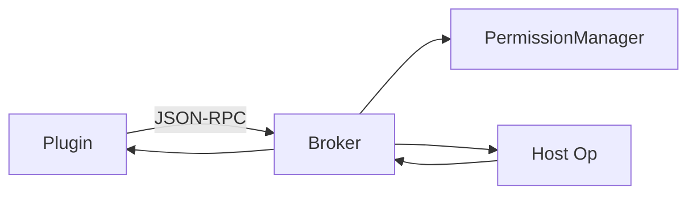
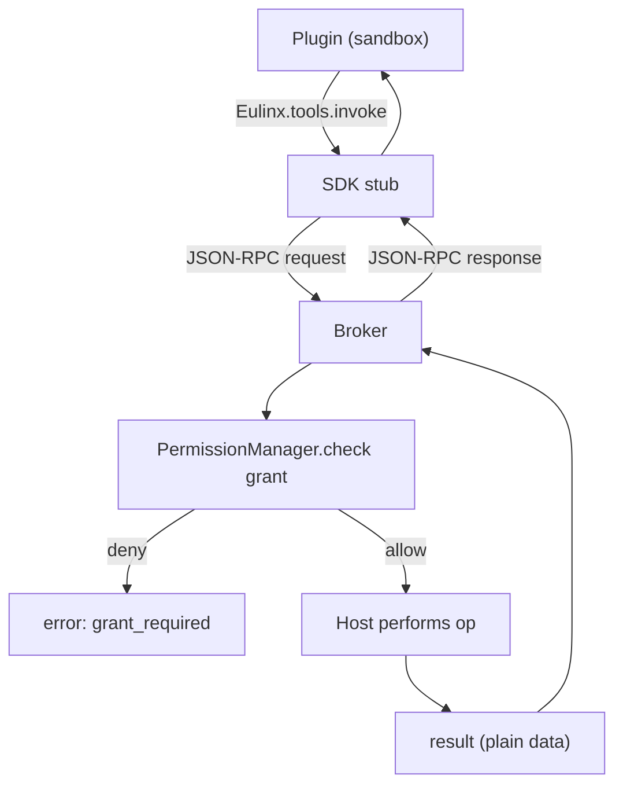
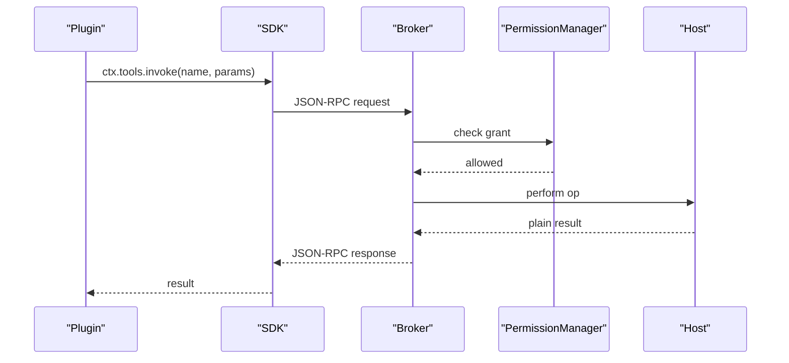
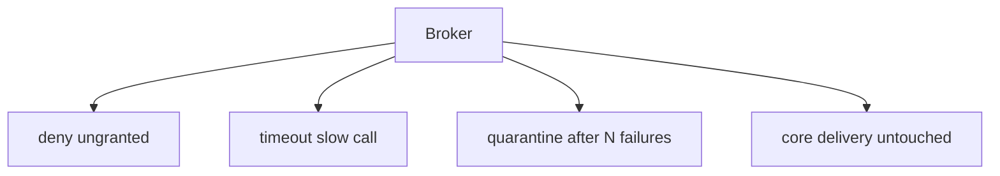
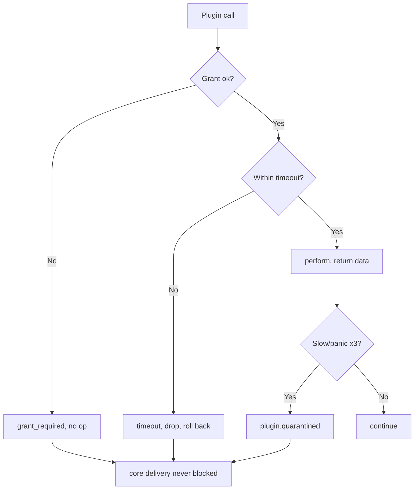
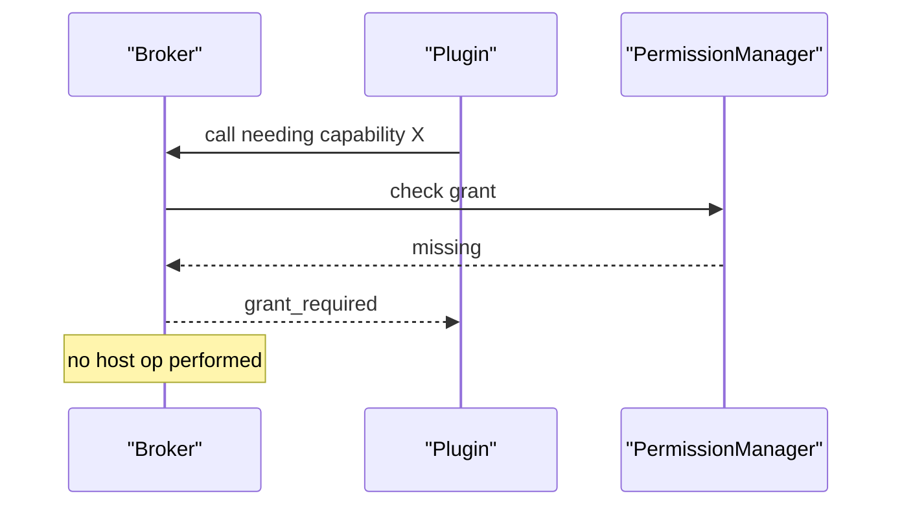
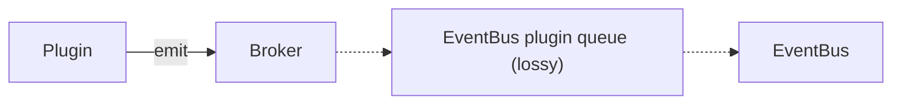
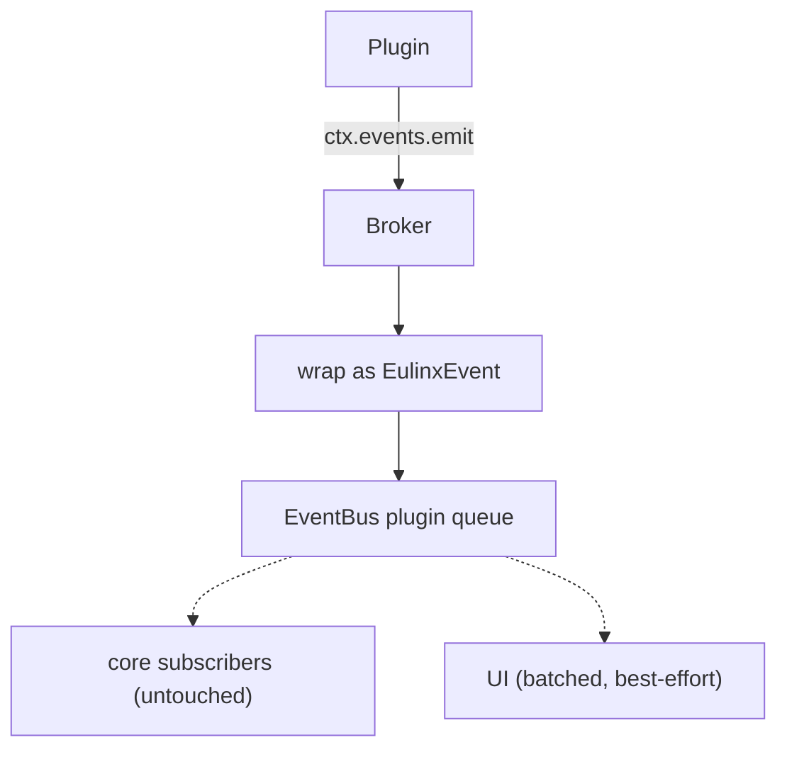
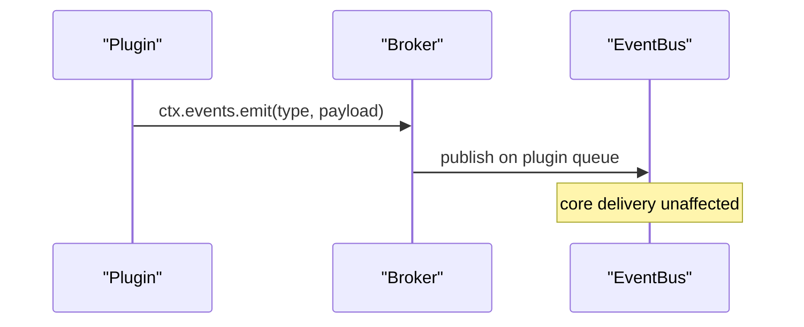

---
title: PluginAPI Diagrams
status: draft
version: 1.0
tags:
  - api
  - plugin-api
  - diagrams
related:
  - "[[PluginAPI-Part01]]"
  - "[[PluginAPI-Part02]]"
  - "[[PluginAPI-Part03]]"
  - "[[PluginAPI-Part04]]"
  - "[[15-api/README]]"
  - "[[PluginSDK-Part01]]"
  - "[[EventBus-Diagrams]]"
---

# PluginAPI Diagrams

Every flow below is rendered as overview mermaid, detailed mermaid, ASCII, and sequence.

## Broker Round Trip

### Overview



### Detailed



### ASCII

```text
Plugin (untrusted sandbox)
   |
   | Eulinx.tools.invoke("web_search", params)
   v
SDK stub -> marshal JSON-RPC
   |
   v  (transport: stdin/stdout or in-proc channel)
Broker (trusted host)
   |
   +-- check grant (PermissionManager)
   |     deny -> error grant_required, NO op
   |
   +-- perform op in host (never in plugin)
   |
   +-- timeout? -> error timeout, roll back if possible
   |
   v
return plain data (no handle)
   |
   v
Plugin receives result
```

### Sequence



## No-Handle Containment

### Overview



### Detailed



### ASCII

```text
Broker invariants:
  - ungranted call  -> deny, perform nothing
  - slow call       -> timeout, drop, roll back if possible
  - panic x3        -> quarantine plugin, unsubscribe all
  - core delivery   -> NEVER blocked by a plugin (separate lossy queue)
```

### Sequence



## Plugin Event Flow

### Overview



### Detailed



### ASCII

```text
Plugin emits observation event
   |
   v
Broker wraps as EulinxEvent (pluginId tagged)
   |
   v
EventBus PLUGIN queue (lossy, isolated)
   |
   +-- core subscribers: NOT on this path
   +-- UI: batched, best-effort
```

### Sequence



## Related Documents

- [[PluginAPI-Part01]]
- [[PluginAPI-Part02]]
- [[PluginAPI-Part03]]
- [[PluginAPI-Part04]]
- [[15-api/README]]
- [[PluginSDK-Part01]]
- [[EventBus-Diagrams]]
- [[IPC-Diagrams]]
