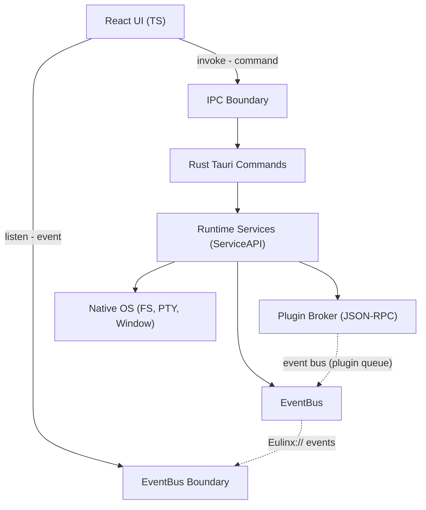

---
title: 15 API
status: draft
version: 1.0
tags:
  - api
  - ipc
  - contracts
  - architecture
  - Eulinx
  - flow:P01-CORE-INTERFACES
  - flow:P01-CORE-SERIALIZE
  - flow:P01-CORE-MODELS
  - flow:P02-RUNTIME-APIS
  - flow:P03-EVENT-SUBSCRIBERS
  - flow:P03-EVENT-PUBLISHERS
  - flow:P03-EVENT-REGISTRY
related:
  - "[[IPC-Part01]]"
  - "[[FrontendAPI-Part01]]"
  - "[[RustAPI-Part01]]"
  - "[[ServiceAPI-Part01]]"
  - "[[PluginAPI-Part01]]"
  - "[[EventAPI-Part01]]"
  - "[[Contracts-Part01]]"
  - "[[07-ui-ux/README]]"
  - "[[02-runtime/README]]"
---

# 15 API

## Purpose

The `15-api` folder is the single, authoritative definition of every interface in Eulinx. It specifies how the React frontend, the thin Rust backend, the internal runtime services, and third-party plugins communicate. It is the contract layer of the entire application: every other section describes what Eulinx *is* and what it *does*, but this section describes *how one part asks another part to do it*.

Eulinx has exactly three transport boundaries, and this folder documents all of them:

- The **UI ↔ Runtime** boundary over the two Tauri channels (`invoke` for commands, `listen` for events). This is owned by [[IPC-Part01]] and consumed by [[FrontendAPI-Part01]].
- The **Runtime → Rust command handler** boundary, where Tauri commands land and are dispatched to runtime services. This is owned by [[RustAPI-Part01]].
- The **Service → Service** boundary inside the Rust runtime, where deterministic services coordinate without going through Tauri. This is owned by [[ServiceAPI-Part01]].
- The **Host ↔ Plugin** boundary over the JSON-RPC broker. This is owned by [[PluginAPI-Part01]].
- The **EventBus boundary**, the one-way broadcast of facts from the Runtime to every observer. This is owned by [[EventAPI-Part01]].
- The shared **request, response, and event shapes** that cross all of the above. This is owned by [[Contracts-Part01]].

Every command, event name, and payload field in this folder is canonical. Nothing outside it may invent a new command or event. The [[Contracts-Part01]] folder is the source of truth for names; the topic folders describe how those names are used.

## Folder Structure

```text
15-api/
  README.md

  IPC/
    IPC-Part01.md ... IPC-Part04.md
    IPC-Diagrams.md

  FrontendAPI/
    FrontendAPI-Part01.md ... FrontendAPI-Part05.md
    FrontendAPI-Diagrams.md

  RustAPI/
    RustAPI-Part01.md ... RustAPI-Part04.md
    RustAPI-Diagrams.md

  ServiceAPI/
    ServiceAPI-Part01.md ... ServiceAPI-Part04.md
    ServiceAPI-Diagrams.md

  PluginAPI/
    PluginAPI-Part01.md ... PluginAPI-Part04.md
    PluginAPI-Diagrams.md

  EventAPI/
    EventAPI-Part01.md ... EventAPI-Part05.md
    EventAPI-Diagrams.md

  Contracts/
    Contracts-Part01.md ... Contracts-Part06.md
    Contracts-Diagrams.md
```

## Total API Specification Size

```text
7 API topic folders
33 specification parts
7 diagram files
1 root README
41 Markdown files in total
```

## Topic Responsibilities

## IPC

IPC owns the two Tauri channels: `invoke` (UI → Runtime, request/response) and `listen` (Runtime → UI, one-way events). It defines the channel direction rule, the serialization format, the error envelope, the event-name scheme, and the listener lifecycle contract. Every command and event name referenced here is defined in [[Contracts-Part01]].

Parts: 4

## FrontendAPI

FrontendAPI owns the TypeScript client surface that the React UI programs against. It is the layer that wraps `invoke` and `listen` so no component ever touches Tauri directly. It covers the service modules, the runtime store mirror, the command-call ergonomics, the event-subscription manager, and the rules for idempotent handlers.

Parts: 5

## RustAPI

RustAPI owns the Rust command-handler surface: the Tauri `#[tauri::command]` functions, the argument and return shapes, how a command is dispatched to a runtime service, the async/sync split, and the thin-backend rule (Rust only does native OS work, never business logic).

Parts: 4

## ServiceAPI

ServiceAPI owns the internal service-to-service boundary inside the Rust runtime. These are in-process calls between deterministic services (Scheduler, LockManager, MergeManager, PermissionManager, ArtifactManager, EventBus, etc.) that never cross Tauri. It defines service traits, the in-process message shapes, the call graph, and the rule that business logic lives here, not in the command layer.

Parts: 4

## PluginAPI

PluginAPI owns the plugin RPC surface: the JSON-RPC broker that lets an untrusted, sandboxed plugin call host capabilities (tools, nodes, hooks, storage, events, scoped network). It references [[PluginSDK-Part01]] for the SDK the plugin authors import, and [[PluginArchitecture-Part05]] for the broker boundary. It defines the request/response envelope, the no-handle rule, the permission check, and the timeout model.

Parts: 4

## EventAPI

EventAPI owns the EventBus event catalog: the naming scheme (`Eulinx://...`), the typed event families, the payload contract, the deliverability classes, and the rule that events are facts, never commands. It is the one-way broadcast counterpart to IPC and must stay consistent with [[EventBus-Part01]].

Parts: 5

## Contracts

Contracts owns the shared request, response, and event shapes that flow across every boundary. It is the canonical name registry: every `invoke` command name, every `Eulinx://` event name, every payload field, and every error code. If a name is not defined here, it does not exist in Eulinx.

Parts: 6

## Global API Principles

The API MUST be bidirectional over exactly two channels: `invoke` (UI → Runtime) and `listen` (Runtime → UI). No third channel, no sockets opened by the UI, no direct provider calls from the frontend. See [[07-ui-ux/README]] (The Two Channels).

The API MUST serialize all payloads as JSON via Serde on the Rust side and `JSON.parse`/`JSON.stringify` on the TS side. A payload MUST be plain, cloneable data — never a handle, never a live object, never a function.

The API MUST return errors in a single, uniform error envelope. A command error is a structured object with a stable `code`, a human message, and an optional `context`. It MUST NOT throw a raw string or a Rust `panic`.

The API MUST treat events as facts. An event name is past tense (`worker.spawned`), never a verb (`worker.spawn`). Commands live in IPC/RustAPI; events live in EventAPI. The EventBus MUST NOT become a control channel. See [[EventBus-Part01]].

The API MUST scope every request and event by `workspaceId`. No command or event may cross a Workspace boundary without an explicit scope.

The API MUST be versioned. Every breaking change to a command, event, or contract shape increments the API version and is recorded. Plugins bind to a semver range. See [[PluginSDK-Part06]].

The API MUST keep the Rust layer thin. A Tauri command handler MUST NOT contain business logic; it validates input, calls a runtime service (ServiceAPI), and returns. Business logic lives in the Rust services or, per the cheap-model constraint, increasingly in TypeScript orchestration.

The API MUST be idempotent on the UI side. Every `listen` handler MUST be safe to run twice, out of order, or late, because events can. Every command call MUST be safe to retry if the caller explicitly does so.

The API MUST NOT leak secrets. Provider keys stay in the OS secure store; the Rust command layer reads them only at the moment of an outbound call and never returns them in a response or an event.

## API Architecture Overview



## ASCII Overview

```text
REACT UI (TypeScript)
   |
   |  invoke("command", args)   ----> UI -> Runtime, request/response
   |  listen("Eulinx://event")     <---- Runtime -> UI, one-way
   v
IPC BOUNDARY  (defined in IPC/)
   |
   v
RUST TAURI COMMANDS  (defined in RustAPI/)
   |  - validate args
   |  - read scope from PermissionManager
   |  - delegate to a runtime service
   v
RUNTIME SERVICES  (defined in ServiceAPI/)
   |  Scheduler, LockManager, MergeManager,
   |  ArtifactManager, PermissionManager, EventBus ...
   |  - deterministic, no LLM, no business rules in commands
   v
EVENTBUS  (defined in EventAPI/)
   |  - facts only, past tense, replay-grade logged
   |  - core queue (guaranteed) / plugin queue (lossy)
   v
PLUGIN BROKER  (defined in PluginAPI/)
   |  - JSON-RPC, host calls only, no handle returned
   v
NATIVE OS  (FS, PTY, windows, secure store)

ALL SHAPES: defined in Contracts/
```

## AI Notes

Do not add a new `invoke` command by guessing a name. Look it up in [[Contracts-Part01]] first. If it is missing, add it to Contracts and to the correct topic Part — do not scatter command definitions across feature folders.

Do not put business logic in a Tauri command. A command validates, authorizes via PermissionManager, calls a ServiceAPI function, and returns. If you find yourself writing scheduling, merging, or AI-calling code inside `#[tauri::command]`, you have violated the thin-backend rule.

Do not make the EventBus carry a request. `worker.spawn` is a command; `worker.spawned` is an event. If a subscriber can change what the Runtime does, the boundary is broken. See [[EventBus-Part01]].

Do not return a file handle, a database connection, or a process handle across any boundary. The PluginAPI no-handle rule applies to every boundary: payloads are data, never resources.

Do not invent an event name that is not past tense. An event is a statement about something that already happened and cannot be undone by receiving it.

Do not skip the `unlisten` cleanup on the frontend. A leaked listener double-applies events after a workspace switch and corrupts the runtime mirror. This is the single most common defect class in Eulinx.

# Related Documents

- [[IPC-Part01]]
- [[FrontendAPI-Part01]]
- [[RustAPI-Part01]]
- [[ServiceAPI-Part01]]
- [[PluginAPI-Part01]]
- [[EventAPI-Part01]]
- [[Contracts-Part01]]
- [[07-ui-ux/README]]
- [[02-runtime/README]]
- [[09-plugin-system/README]]
- [[EventBus-Part01]]
- [[PluginSDK-Part01]]
