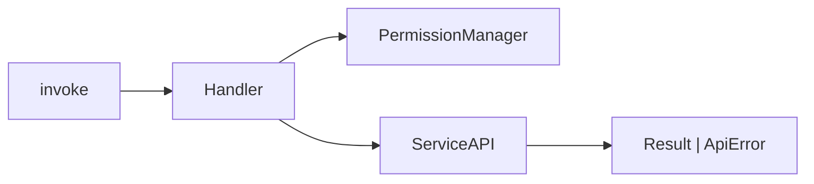
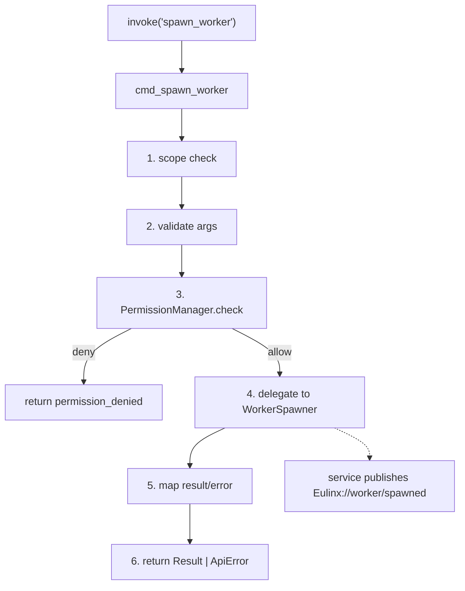
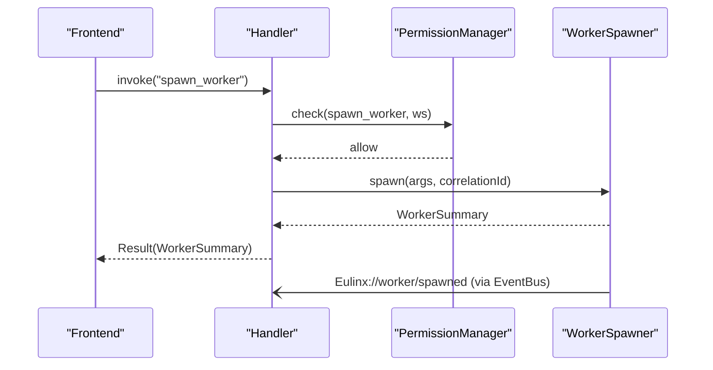
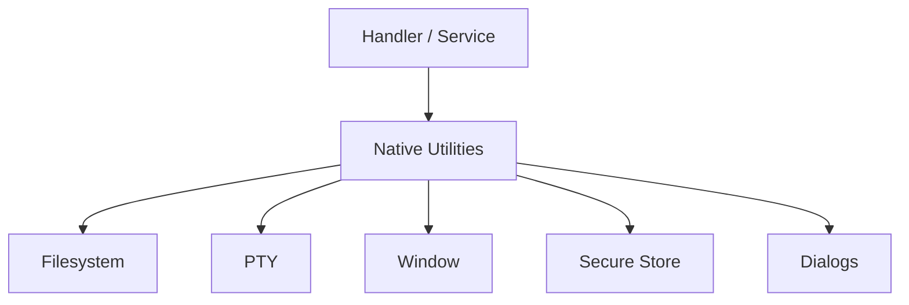
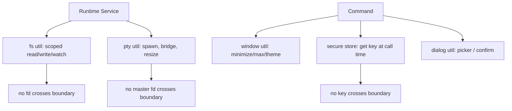
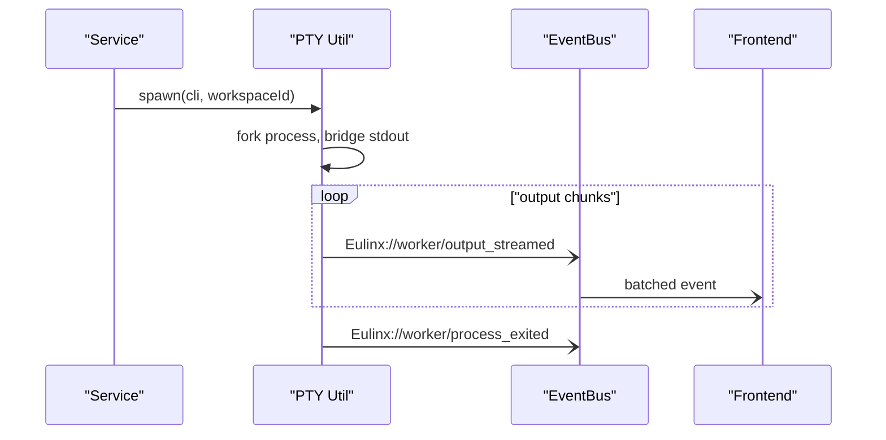

---
title: RustAPI Diagrams
status: draft
version: 1.0
tags:
  - api
  - rust-api
  - diagrams
related:
  - "[[RustAPI-Part01]]"
  - "[[RustAPI-Part02]]"
  - "[[RustAPI-Part03]]"
  - "[[RustAPI-Part04]]"
  - "[[15-api/README]]"
  - "[[IPC-Diagrams]]"
  - "[[ServiceAPI-Diagrams]]"
---

# RustAPI Diagrams

Every flow below is rendered as overview mermaid, detailed mermaid, ASCII, and sequence.

## Command Handler Flow

### Overview



### Detailed



### ASCII

```text
invoke("spawn_worker", args)
   |
   v
cmd_spawn_worker
   1. scope: workspace_id present & attached?  -> else workspace_scope_mismatch
   2. validate: required fields, enum, size     -> else validation_error(field)
   3. authorize: PermissionManager.check        -> else permission_denied
   4. delegate: WorkerSpawner.spawn(args, cid)  <- ONLY step with side effects
   5. map: Ok -> result, Err -> ApiError(code)
   6. return
   |
   v
Tauri serializes Result | ApiError envelope
```

### Sequence



## Native OS Surface

### Overview



### Detailed



### ASCII

```text
Rust native utilities (the ONLY Rust responsibilities):
  fs       -> scoped to workspace root, streams, watches, no fd returned
  pty      -> spawn shell/CLI, bridge output->events, resize, no master fd returned
  window   -> minimize/maximize/title/theme, OS-level only
  secure   -> keychain/secret-service, key yielded only at outbound call, never returned
  dialog   -> file/folder picker, destructive confirm (feeds approval gate)
```

### Sequence



## Related Documents

- [[RustAPI-Part01]]
- [[RustAPI-Part02]]
- [[RustAPI-Part03]]
- [[RustAPI-Part04]]
- [[15-api/README]]
- [[IPC-Diagrams]]
- [[ServiceAPI-Diagrams]]
