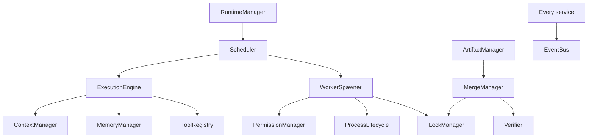
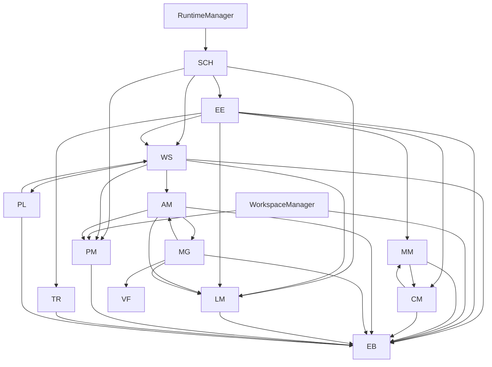
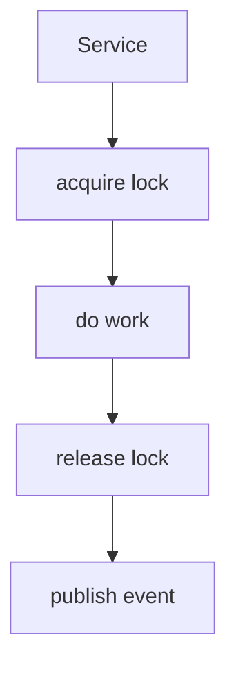
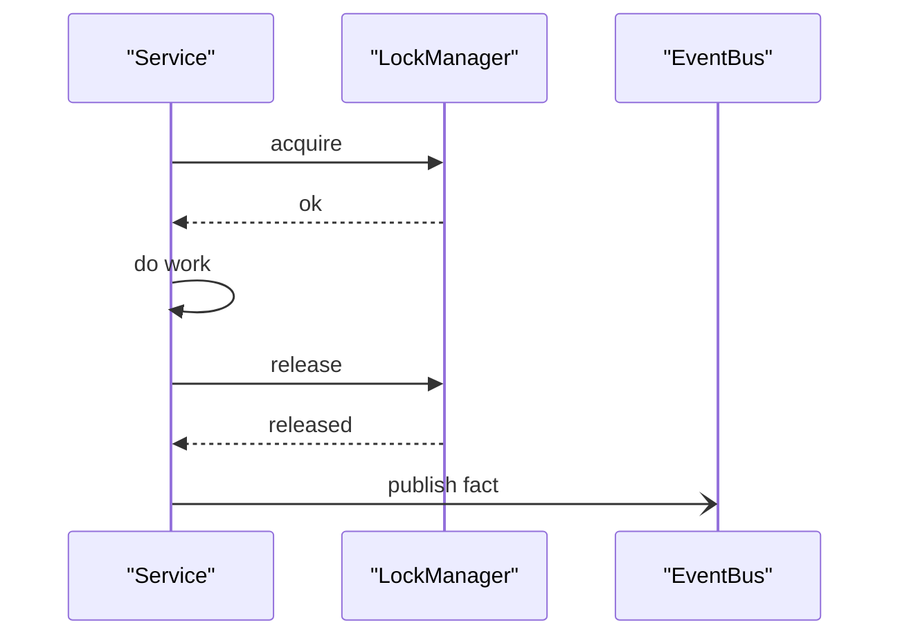
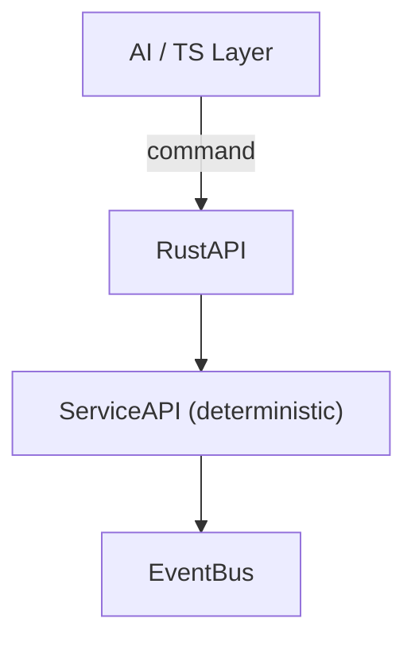
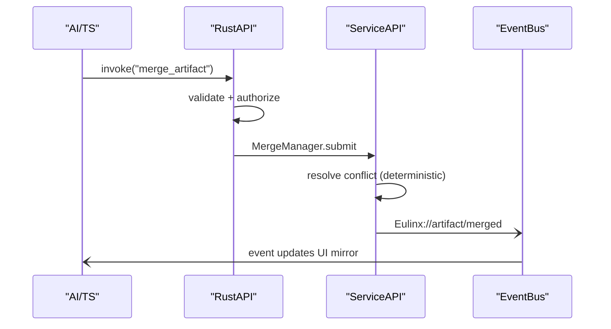

---
title: ServiceAPI Diagrams
status: draft
version: 1.0
tags:
  - api
  - service-api
  - diagrams
related:
  - "[[ServiceAPI-Part01]]"
  - "[[ServiceAPI-Part02]]"
  - "[[ServiceAPI-Part03]]"
  - "[[ServiceAPI-Part04]]"
  - "[[15-api/README]]"
  - "[[EventBus-Diagrams]]"
  - "[[RustAPI-Diagrams]]"
---

# ServiceAPI Diagrams

Every flow below is rendered as overview mermaid, detailed mermaid, ASCII, and sequence.

## Service Call Graph

### Overview



### Detailed



### ASCII

```text
RuntimeManager
  -> Scheduler -> WorkerSpawner, ExecutionEngine, LockManager, PermissionManager
WorkerSpawner
  -> ProcessLifecycle, LockManager, PermissionManager, ArtifactManager, EventBus
ExecutionEngine
  -> WorkerSpawner, ToolRegistry, MemoryManager, ContextManager, LockManager, EventBus
WorkspaceManager -> PermissionManager, EventBus
MemoryManager -> ContextManager, EventBus
ContextManager -> MemoryManager, EventBus
ArtifactManager -> MergeManager, LockManager, PermissionManager, EventBus
MergeManager -> ArtifactManager, LockManager, Verifier, EventBus
LockManager / PermissionManager / ToolRegistry / ProcessLifecycle -> EventBus (leaf)

RULE: every service may publish; no service is called back by the bus.
RULE: call graph is acyclic.
```

### Sequence

```mermaid
sequenceDiagram
  participant S as "Scheduler"
  participant W as "WorkerSpawner"
  participant L as "LockManager"
  participant E as "EventBus"

  S->>W: spawn(args)
  W->>L: request_lock(resource)
  L-->>W: granted
  W->>W: fork via ProcessLifecycle
  W-)E: Eulinx://worker/spawned
  Note over S,E: Scheduler never calls EventBus for worker; WorkerSpawner publishes
```

## Deterministic Publish (no lock held)

### Overview



### ASCII

```text
WRONG (deadlock risk):
  acquire_lock()
  publish_event()   <- bus may await a slow subscriber while lock held
  release_lock()

RIGHT:
  acquire_lock()
  do_work()
  release_lock()    <- lock released FIRST
  publish_event()   <- bus awaits freely
```

### Sequence



## AI vs Runtime Split

### Overview



### ASCII

```text
AI / TS layer (plans, reasons, refines)  --issues commands-->
RustAPI (validate, authorize, translate)  --delegates-->
ServiceAPI (schedule, lock, merge, verify, store, publish)  --broadcasts-->
EventBus (facts only)

Rule: services are deterministic, no LLM.
Rule: the command handler is a thin facade.
Rule: business logic that is mechanical lives in the service.
```

### Sequence



## Related Documents

- [[ServiceAPI-Part01]]
- [[ServiceAPI-Part02]]
- [[ServiceAPI-Part03]]
- [[ServiceAPI-Part04]]
- [[15-api/README]]
- [[RustAPI-Diagrams]]
- [[EventBus-Diagrams]]
