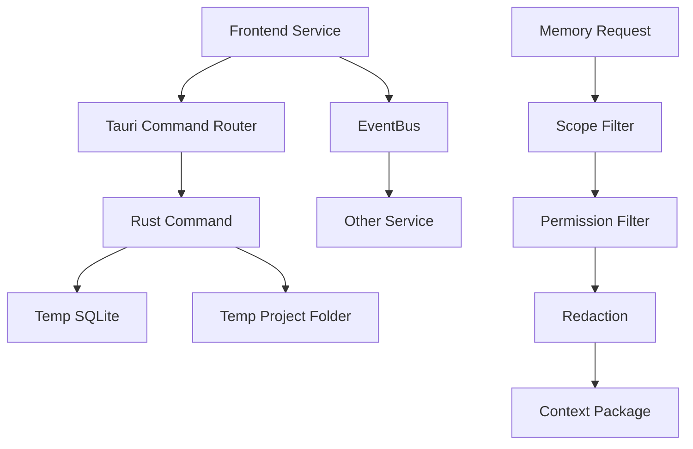

# IntegrationTesting Diagrams



```text
Integration Seams
  service -> router -> rust -> sqlite
  service -> eventbus -> subscriber
  memory -> scope -> permission -> redact -> package
  all inside an isolated temp workspace
```

# Related Documents

- [[IntegrationTesting-Part01]]
- [[04-memory/ContextInjection-Part01]]
