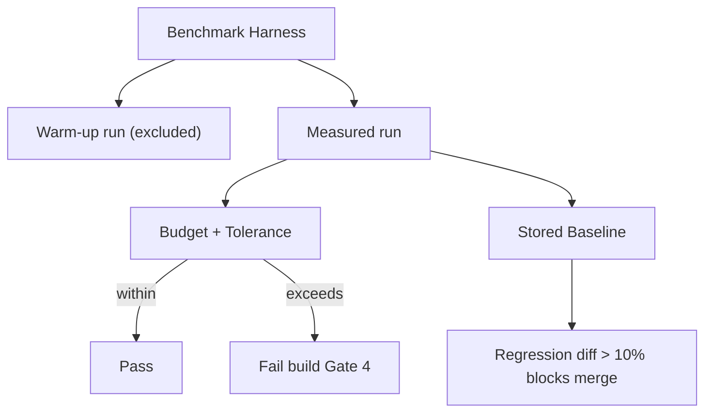

# PerformanceTesting Diagrams



```text
Frame Budget
  60fps => 16ms per interactive frame (hard)
  100+ nodes => 33ms floor during pan/zoom
  terminal => keep pace, no dropped frames
  memory => bounded per workspace, no leak
```

# Related Documents

- [[PerformanceTesting-Part01]]
- [[TestingStrategy-Part04]]
