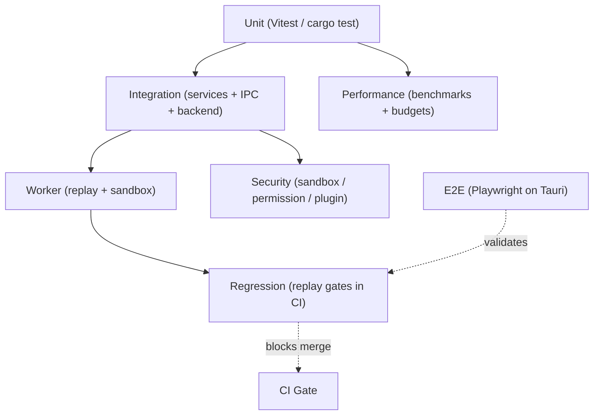

---
title: 16 Testing
status: draft
version: 1.0
tags:
  - testing
  - quality
  - architecture
  - Eulinx
  - flow:P00-TESTS
  - flow:P17-CLI-DOCTOR
  - flow:P20-REL-UNIT
  - flow:P20-REL-INT
  - flow:P20-REL-E2E
  - flow:P20-REL-LOAD
related:
  - "[[TestingStrategy-Part01]]"
  - "[[UnitTesting-Part01]]"
  - "[[12-development/README]]"
  - "[[12-development/TestingRules/TestingRules-Part01]]"
  - "[[02-runtime/README]]"
  - "[[06-workflow-engine/README]]"
  - "[[09-plugin-system/README]]"
  - "[[04-memory/README]]"
---

# 16 Testing

## Purpose

The `16-testing` folder defines Eulinx's complete testing discipline.

Eulinx is a local-first desktop application built on Tauri v2 (a thin Rust backend) with a React 19 + TypeScript frontend. Because the coding model that builds Eulinx is a cheaper assistant (DeepSeek V4 Flash class), the codebase MUST be protected by a disciplined, automated test harness that catches regressions before they reach the user.

Testing in Eulinx is not an afterthought. It is a structural guarantee that:

- TypeScript business logic (the ~90–95% majority of the app) is verifiable with fast unit and integration suites.
- The thin Rust backend (PTY, filesystem, IPC bridge) is covered by `cargo test`.
- Multi-agent runtime behaviour (Workers, Orchestrators, Artifacts, memory injection) is deterministic and replayable.
- The 60fps / 16ms interaction budget is enforced by performance tests.
- The sandbox, permission model, and plugin boundary are verified against adversarial input.
- End-to-end flows are covered by Playwright against the real Tauri shell.

This section owns the testing philosophy, the pyramid, and the per-domain policies. It does not own CI configuration details (that lives in [[12-development/README]]) but it declares the gates CI MUST enforce.

## Folder Structure

```text
16-testing/
  README.md
  TestingStrategy/
    TestingStrategy-Part01.md ... Part04.md
    TestingStrategy-Diagrams.md
  UnitTesting/
    UnitTesting-Part01.md ... Part04.md
    UnitTesting-Diagrams.md
  IntegrationTesting/
    IntegrationTesting-Part01.md ... Part04.md
    IntegrationTesting-Diagrams.md
  WorkerTesting/
    WorkerTesting-Part01.md ... Part05.md
    WorkerTesting-Diagrams.md
  PerformanceTesting/
    PerformanceTesting-Part01.md ... Part04.md
    PerformanceTesting-Diagrams.md
  SecurityTesting/
    SecurityTesting-Part01.md ... Part04.md
    SecurityTesting-Diagrams.md
  RegressionTesting/
    RegressionTesting-Part01.md ... Part04.md
    RegressionTesting-Diagrams.md
```

## Total Testing Specification Size

```text
7 testing topic folders
29 specification parts
7 diagram files
1 root README
```

## Topic Responsibilities

### TestingStrategy
Owns the overall testing philosophy: the test pyramid, what is tested at which layer, the canonical toolchain, and the CI gate contract.
Parts: 4

### UnitTesting
Owns the Vitest (frontend) and `cargo test` (Rust) unit policy: what must have unit coverage, isolation rules, fakeable boundaries, and coverage thresholds.
Parts: 4

### IntegrationTesting
Owns cross-service integration tests: how frontend services, Tauri IPC, Rust backend, SQLite, and the EventBus are exercised together in a controlled environment.
Parts: 4

### WorkerTesting
Owns deterministic testing of Workers, Orchestrators, and the AI runtime: sandboxed execution, artifact production, refinement loop, and replay-driven verification.
Parts: 5

### PerformanceTesting
Owns benchmarks and budgets: the 60fps / 16ms interaction budget, canvas and terminal throughput, memory ceilings, and load/concurrency limits.
Parts: 4

### SecurityTesting
Owns adversarial testing of the sandbox, permission model, plugin boundary, and secret handling.
Parts: 4

### RegressionTesting
Owns replay-based regression detection and the CI gates that block merges on regressions.
Parts: 4

## Global Testing Principles

Eulinx tests MUST follow these rules unless an explicit ADR overrides them.

- Tests MUST be deterministic. No test may depend on wall-clock time, real network, real model API, or randomness without a seeded fake.
- Tests MUST run without a real Tauri window for unit and integration layers. The Tauri `invoke` bridge MUST be replaced by a fake service in unit tests.
- A test MUST NOT touch the user's real project folder. Integration and worker tests MUST use an isolated in-memory or temp workspace.
- The Rust backend MUST be kept thin, and every Rust command MUST have at least one `cargo test` exercising its failure paths.
- Every Worker behaviour MUST be reproducible from a recorded Replay (see [[04-memory/Replay/Replay-Part01]]).
- Coverage thresholds MUST be enforced in CI: frontend logic MUST keep >= 80% line coverage; runtime-critical paths MUST keep >= 90%.
- Performance tests MUST fail the build if a measured frame or operation exceeds the declared budget.
- Security tests MUST include "should refuse" cases for every permission and every plugin boundary.
- Tests MUST be named to express intent: `should_...` for behaviour, `refuses_...` for security, `within_budget_...` for performance.
- A flaky test MUST be quarantined and fixed, never muted permanently (see [[RegressionTesting-Part03]]).

## Testing Architecture Overview



```text
Eulinx Test Layers
  Unit ............ 70% of tests, fastest, no Tauri, fakes everywhere
  Integration ..... services + IPC + Rust backend together
  Worker .......... deterministic agent runtime via Replay
  Performance ..... 60fps / 16ms budgets, memory ceilings
  Security ........ adversarial sandbox + permission + plugin
  Regression ...... replay-based gates in CI
  E2E ............. Playwright drives the real Tauri shell
```

## AI Notes

Do not write a test that calls the real `invoke` bridge; always inject a fake service so the test is portable and fast.

Do not test React components by rendering the full app; prefer testing the store and service the component reads from.

Do not rely on real model output in Worker tests; drive the runtime from recorded Replays and seeded fakes.

Do not let a performance test depend on machine speed; assert against a budget with a tolerance margin and a warm-up run.

Do not skip the "refuses" security case when adding a permission; a missing refusal test is a missing guarantee.

# Related Documents

- [[TestingStrategy-Part01]]
- [[UnitTesting-Part01]]
- [[IntegrationTesting-Part01]]
- [[WorkerTesting-Part01]]
- [[PerformanceTesting-Part01]]
- [[SecurityTesting-Part01]]
- [[RegressionTesting-Part01]]
- [[12-development/TestingRules/TestingRules-Part01]]
