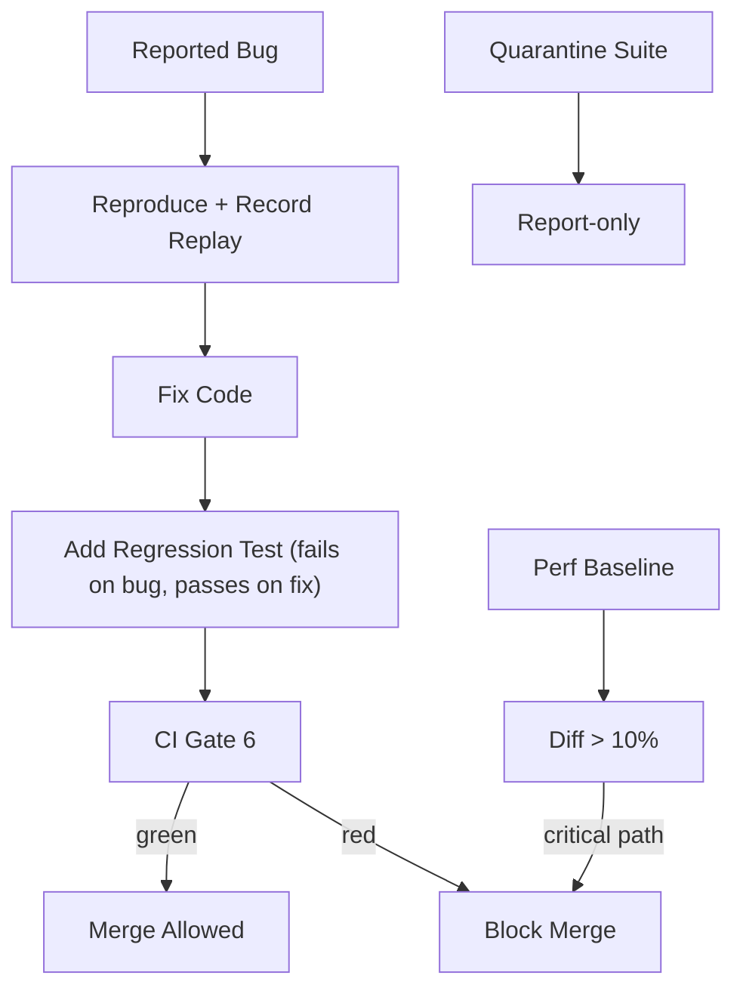

---
title: RegressionTesting Diagrams
status: draft
version: 1.0
tags:
  - testing
  - diagrams
related:
  - "[[RegressionTesting-Part01]]"
---

# RegressionTesting Diagrams



```text
Regression Flow
  bug -> record replay -> fix -> assert on replay -> guard forever
  perf -> baseline diff -> block on critical regression
  flake -> quarantine -> fix determinism -> restore
```

# Related Documents

- [[RegressionTesting-Part01]]
- [[04-memory/Replay/Replay-Part01]]
- [[TestingStrategy-Part04]]
