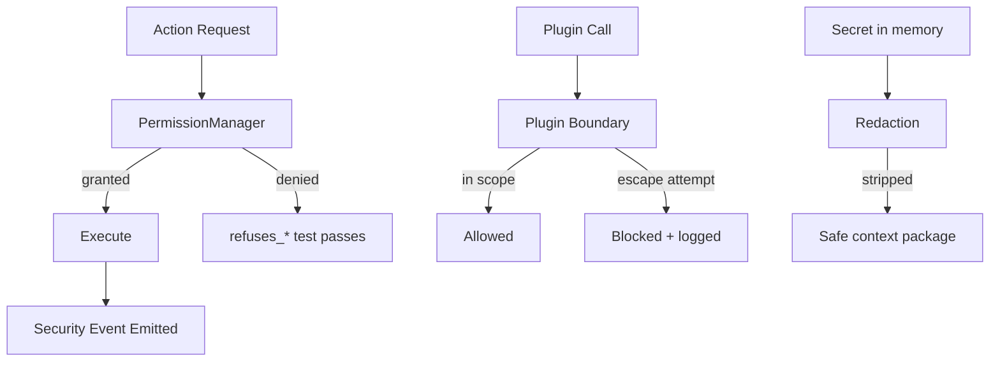

# SecurityTesting Diagrams



```text
Refusal-First Pairs
  for each capability:
    should_<action>  when granted
    refuses_<action> when absent
    gate blocks destructive until human approves
```

# Related Documents

- [[SecurityTesting-Part01]]
- [[02-runtime/PermissionManager-Part01]]
