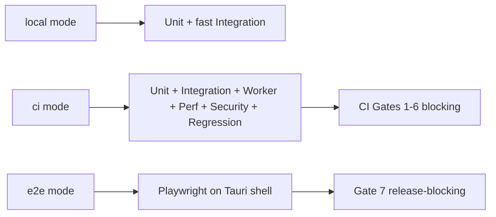
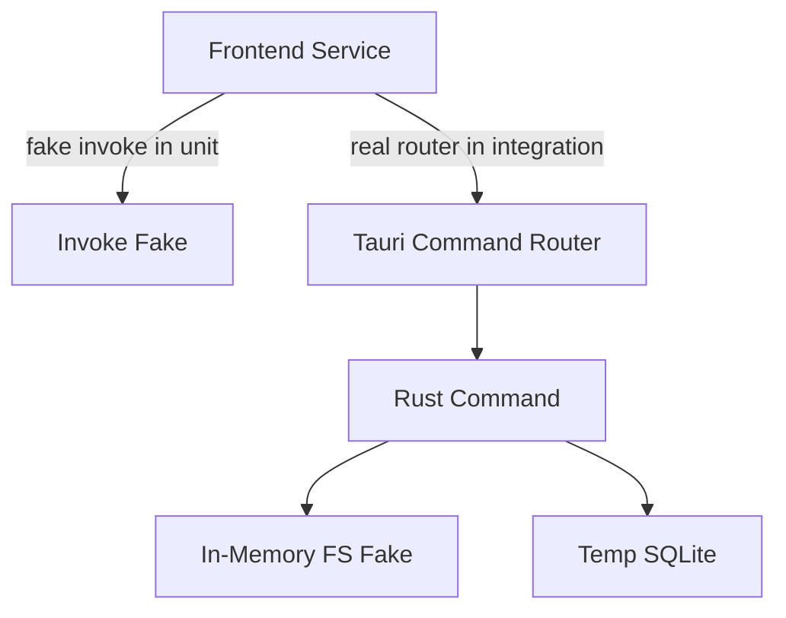

# TestingStrategy Diagrams



```text
CI Execution Order
  Gate1 Unit -------- block
  Gate2 Integration - block
  Gate3 Worker ------ block
  Gate4 Performance -- block
  Gate5 Security ----- block
  Gate6 Regression --- block
  Gate7 E2E --------- release-block
```



# Related Documents

- [[TestingStrategy-Part01]]
- [[IntegrationTesting-Part01]]
