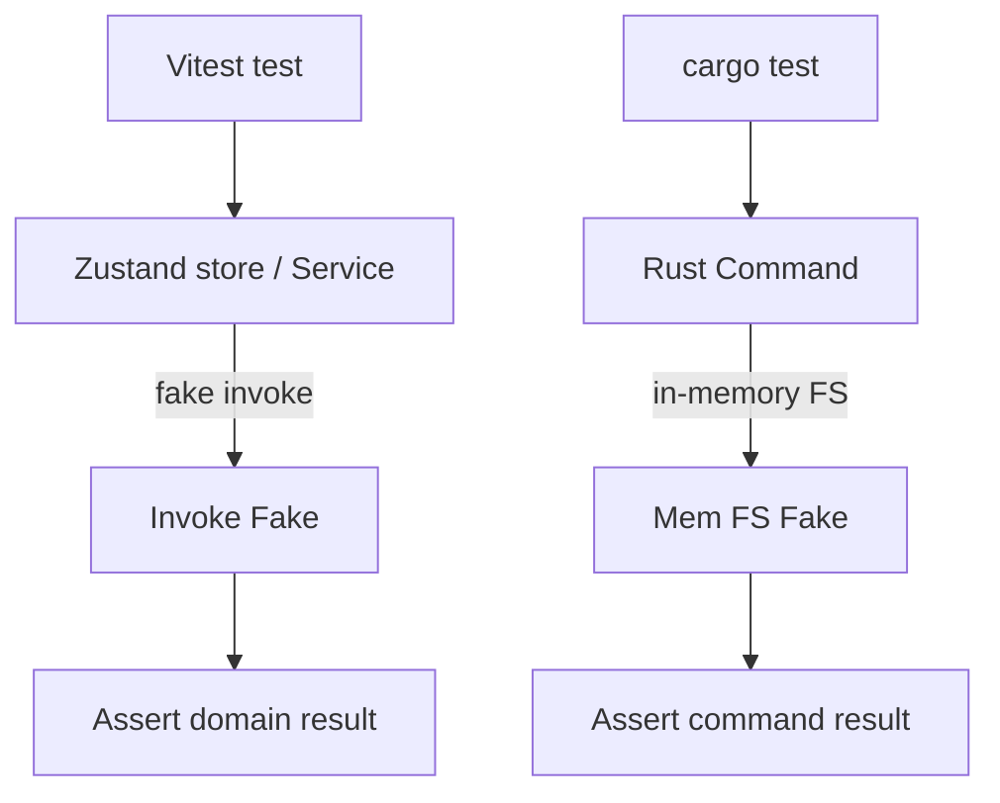

# UnitTesting Diagrams



```text
Unit Layer Isolation
  test -- resets store -- action -- assert state
  test -- programs invoke fake -- service -- assert mapping
  test -- temp dir -- rust command -- assert error shape
```

# Related Documents

- [[UnitTesting-Part01]]
- [[IntegrationTesting-Part01]]
