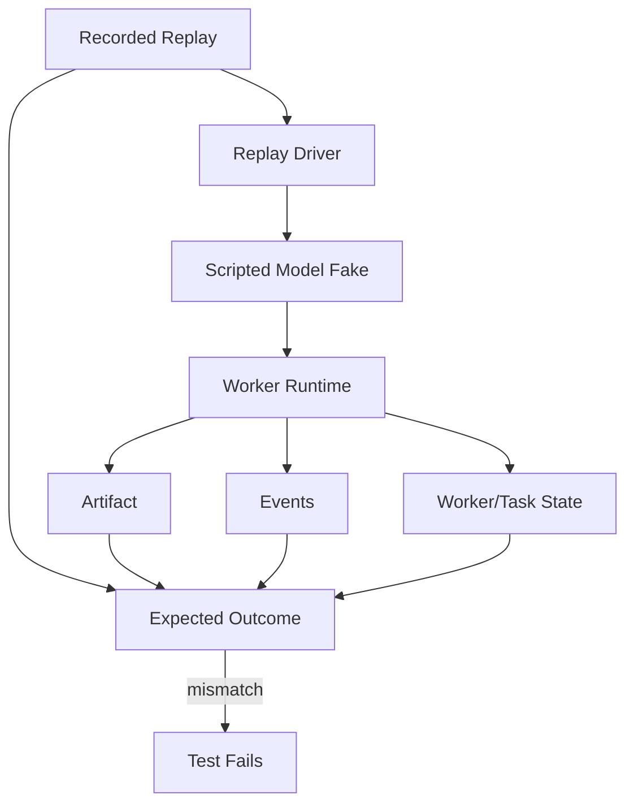

---
title: WorkerTesting Diagrams
status: draft
version: 1.0
tags:
  - testing
  - diagrams
related:
  - "[[WorkerTesting-Part01]]"
---

# WorkerTesting Diagrams



```text
Worker Test Flow
  Replay -- drives --> Model Fake -- streams --> Runtime
  Runtime -- emits --> Artifacts + Events + State
  All three -- compared to --> Expected (from Replay)
  Divergence = failure
```

# Related Documents

- [[WorkerTesting-Part01]]
- [[04-memory/Replay/Replay-Part01]]
