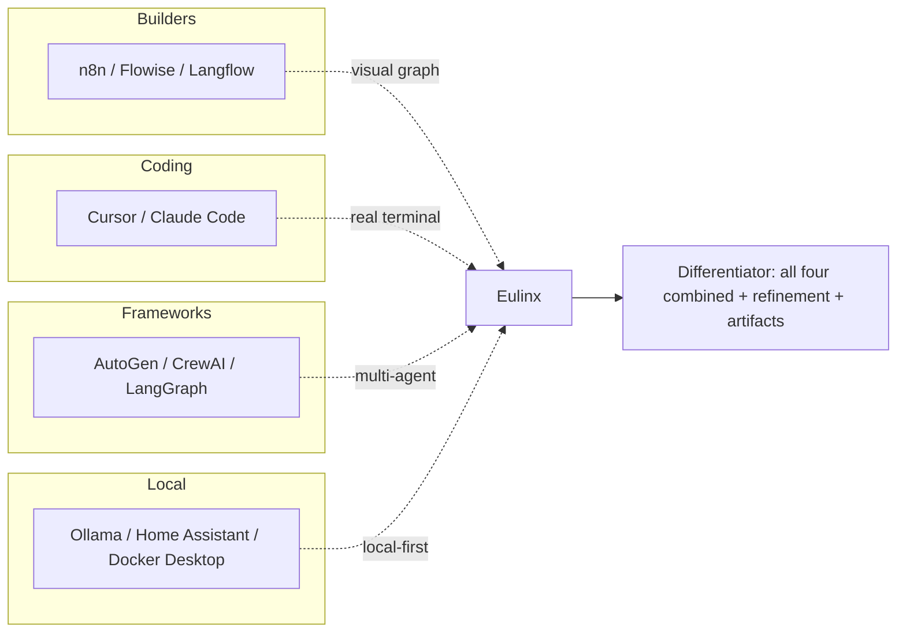

---
title: CompetitorAnalysis Diagrams
status: draft
version: 1.0
tags:
  - research
  - diagrams
  - competitors
related:
  - "[[CompetitorAnalysis-Part01]]"
---

# CompetitorAnalysis Diagrams



```text
Competitors each own ONE axis:
  n8n cluster  -> visual graph (no living agents)
  Cursor       -> real terminal (no graph)
  Agent fwks   -> multi-agent (no desktop shell)
  Ollama/HA    -> local-first (no orchestration UI)

Eulinx owns the INTERSECTION of all four,
plus refinement control and artifact flow.
```

# Positioning Map (ASCII)

```text
                 Visual Graph
                     |
   n8n cluster       |       Eulinx
        *            |        *
                     |
  -------------------------------------------------> Real Terminals
                     |
   LangGraph         |   Cursor / Claude Code
        *            |        *
                     |
   (Agent frameworks)|   (Coding tools)
```

# Related Documents

- [[CompetitorAnalysis-Part01]]
- [[CompetitorAnalysis-Part02]]
- [[CompetitorAnalysis-Part03]]
