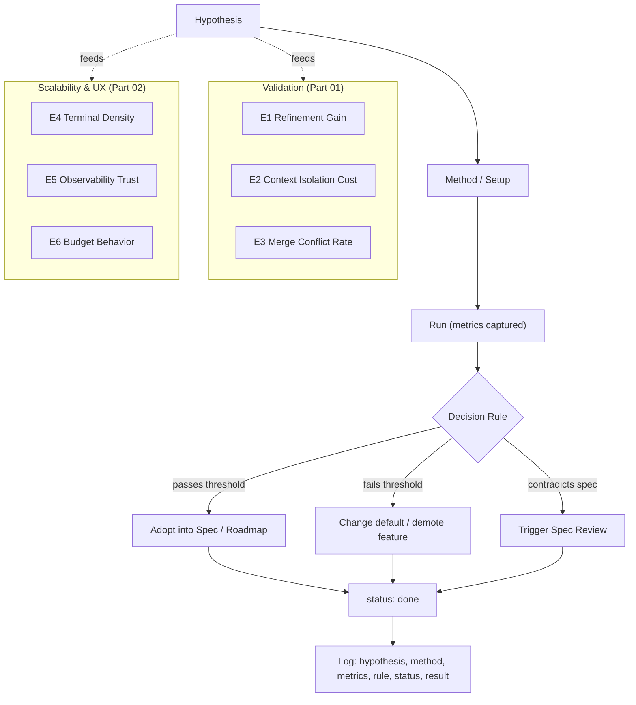

# Experiments Diagrams



```text
EXPERIMENT LIFECYCLE
====================
  Hypothesis
     |
     v
  Method / Setup  (benchmark, N workers, A/B arms)
     |
     v
  Run  ->  capture metrics (cost, tokens, time, conflict %, correction speed)
     |
     v
  Decision Rule  -- threshold check -->
     |-- pass  -->  Adopt into Spec / Roadmap
     |-- fail  -->  Change default / demote feature
     |-- contradicts spec -->  Trigger Spec Review (never silent abandon)
     |
     v
  Log (status: planned|running|done|superseded) + result link

EXPERIMENT CATALOG
==================
 Part 01 (Validation)
   E1  Refinement Gain on Cheap Models   -> default max mode (High vs Ultra)
   E2  Context Isolation Cost            -> simplify memory bus if <15% saved
   E3  Parallel Worker Merge Conflicts   -> tighten Lock Manager if rate high
 Part 02 (Scalability & UX)
   E4  Terminal Density Limit            -> default max visible + auto-collapse
   E5  Observability Trust (animation)   -> demote to opt-in if no gain
   E6  Budget Behavior                   -> Ultra explicit confirmation?
```

# Related Documents
- [[Experiments-Part01]]
- [[13-roadmap/README]]
- [[10-ai-system/README]]
