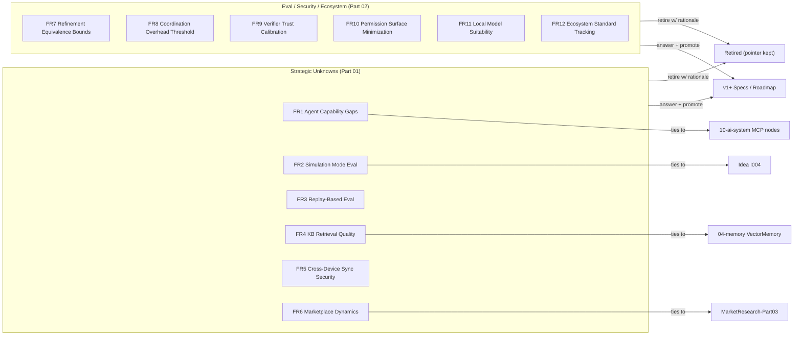

# FutureResearch Diagrams



```text
FUTURE-RESEARCH DIRECTION MAP
=============================
 Part 01 - Strategic Unknowns & Capability Gaps
   FR1  Agent Capability Gaps (web/image/video/publish/research via MCP)
   FR2  Simulation Mode Evaluation (dry-run trust)
   FR3  Replay-Based Evaluation (regression/eval corpus)
   FR4  Knowledge Base Retrieval Quality (workspace vs global)
   FR5  Cross-Device Sync Security (E2E, local-first)
   FR6  Marketplace Dynamics (governance / safety)

 Part 02 - Evaluation, Security, Ecosystem
   FR7  Refinement Equivalence Bounds (cheap vs flagship)
   FR8  Coordination Overhead Threshold (worker-count ceiling)
   FR9  Verifier Trust Calibration (LLM-judge confidence)
   FR10 Permission Surface Minimization (smallest vocabulary)
   FR11 Local Model Suitability (Ollama/LM Studio in loop)
   FR12 Ecosystem Standard Tracking (beyond MCP)

 CLOSURE
   direction --(a) answered + promoted--> Spec / Roadmap
   direction --(b) retired + rationale --> Retired (keeps pointer to decision)

 LINKS OUT
   FR1  -> 10-ai-system (MCP capability nodes)
   FR2  -> Idea I004 (Simulation Mode)
   FR3  -> Experiments E1/E5 data reuse
   FR4  -> 04-memory VectorMemory
   FR5  -> Plus/Pro tiers (MarketResearch-Part03)
   FR6  -> GTM wedge (Marketplace)
   FR7  -> Papers-Part02 / Experiment E1
   FR8  -> Scheduler caps / auto-spawn ceiling
   FR9  -> Papers-Part02 (objective vs semantic)
   FR10 -> 02-runtime PermissionManager
   FR11 -> CompetitorAnalysis-Part03 / BYOK
   FR12 -> MCP layer future-proofing (REF-015)
```

# Related Documents
- [[FutureResearch-Part01]]
- [[13-roadmap/README]]
- [[10-ai-system/README]]
