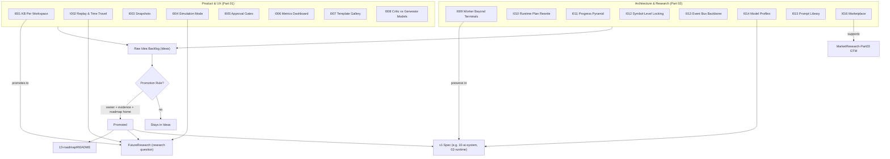

# Ideas Diagrams



```text
IDEA-CATALOG TAXONOMY
=====================
 Source: Raw backlog (hunches, user suggestions, opportunities)
 Promotion Rule: (a) clear owner topic  (b) evidence/rationale  (c) roadmap home

 Part 01 - Product & UX
   I001  Knowledge Base Per Workspace      -> FutureResearch (KB retrieval)
   I002  Replay & Time Travel              -> FutureResearch (replay eval)
   I003  Snapshots of Workspace State      -> memory notes (partial)
   I004  Simulation Mode                   -> FutureResearch FR2
   I005  Human Approval Gates (nodes)      -> 02-runtime PermissionManager
   I006  Metrics Dashboard                 -> worker metrics extension
   I007  Template Gallery (growth)         -> CompetitorAnalysis-Part01
   I008  Different Critic vs Generator     -> PRD open question

 Part 02 - Architecture & Research
   I009  Worker Beyond Terminals           -> 03-worker-system principle
   I010  Orchestrators Rewrite Plan        -> workflow engine research
   I011  Progress Aggregation Pyramid      -> Scheduler/metrics
   I012  Symbol-Level Locking              -> 02-runtime Lock Manager
   I013  Event Bus As Plugin Backbone      -> EventBus spec
   I014  Model Profiles (intent->model)    -> 10-ai-system
   I015  Prompt Library & Inheritance      -> AI system spec (when scoped)
   I016  Marketplace (workflows/agents/...) -> MarketResearch-Part03 GTM

 FLOW
   Ideas --> (promote) --> Roadmap | FutureResearch | Spec
   Ideas --> (stay)    --> backlog (single indexed entry)
```

# Related Documents
- [[Ideas-Part01]]
- [[13-roadmap/README]]
- [[10-ai-system/README]]
