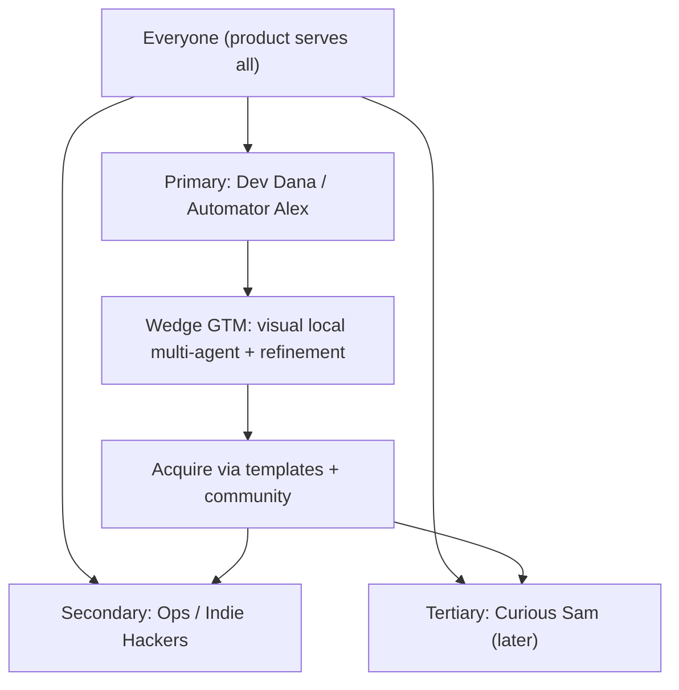

# MarketResearch Diagrams



```text
Acquisition order (narrow -> broad):
  Dev/Automator (wedge)
        |
        | templates + community
        v
  Ops / Indie Hackers
        |
        v
  Casual users (templates-only)
```

# Persona -> Feature Priority Map

```text
Dev Dana      -> terminals, refinement, git, verification
Automator Alex-> graph, triggers, MCP nodes, approval gates
Curious Sam   -> templates, defaults, onboarding, calm UI
```

# Related Documents

- [[MarketResearch-Part01]]
- [[MarketResearch-Part02]]
- [[MarketResearch-Part03]]
