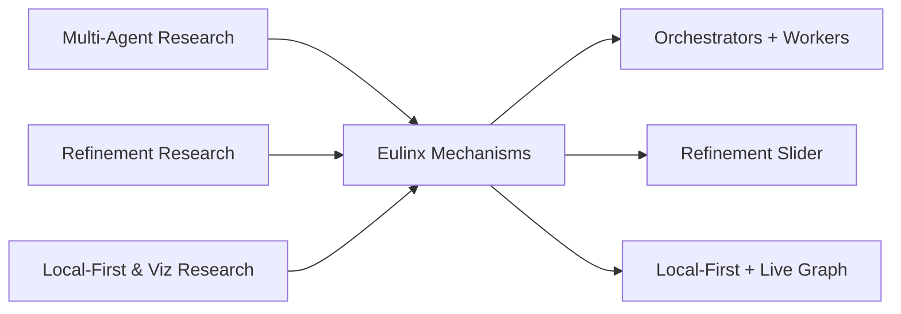

---
title: Papers Diagrams
status: draft
version: 1.0
tags:
  - research
  - diagrams
  - papers
related:
  - "[[Papers-Part01]]"
---

# Papers Diagrams



```text
Literature -> Eulinx mechanism
  orchestrator-workers  -> Root/Phase/Task + Workers
  Self-Refine ~20%      -> refinement slider
  Refine-n-Judge ~98%   -> judge + stopping rule
  Reflexion             -> worker memory + replay
  local-first           -> BYOK + export
  visual comprehension  -> live artifact graph
```

# Refinement Loop Grounded In Literature

```text
Generate (cheap model)
   |
   v
Critic (feedback)       <- Self-Refine
   |
   v
Refine (revise)
   |
   v
Judge (accept?)         <- Refine-n-Judge
   | no
   +----> repeat (up to mode max)
   | yes
   v
Accept
```

# Related Documents

- [[Papers-Part01]]
- [[Papers-Part02]]
- [[Papers-Part03]]
- [[Papers-Part04]]
