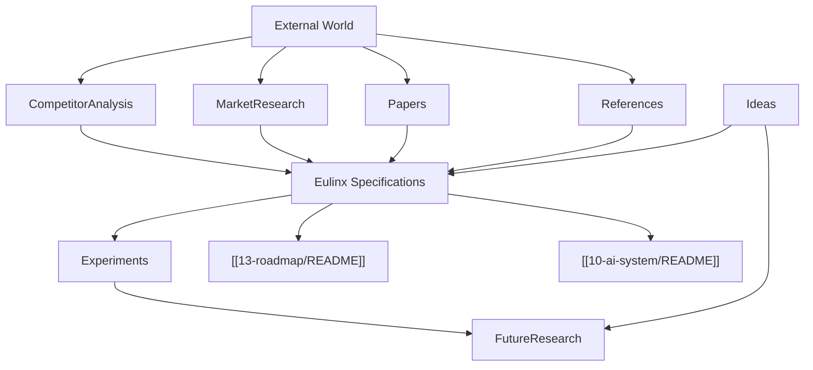

---
title: 17 Research
status: draft
version: 1.0
tags:
  - research
  - Eulinx
  - market
  - competitors
  - literature
related:
  - "[[CompetitorAnalysis-Part01]]"
  - "[[MarketResearch-Part01]]"
  - "[[Papers-Part01]]"
  - "[[References-Part01]]"
  - "[[Experiments-Part01]]"
  - "[[Ideas-Part01]]"
  - "[[FutureResearch-Part01]]"
  - "[[13-roadmap/README]]"
  - "[[10-ai-system/README]]"
  - "[[04-memory/README]]"
---

# 17 Research

## Purpose

The `17-research` folder is the evidence and intelligence layer of the Eulinx specification vault.

It collects the external facts, competitive context, market positioning, academic literature, reference material, internal experiments, raw idea backlog, and future investigation directions that justify and inform every product and architecture decision made elsewhere in the vault.

Research exists so that Eulinx's design is grounded, not ideological. Every major claim in the [[13-roadmap/README]] and the [[10-ai-system/README]] (multi-agent effectiveness, refinement loops, local-first privacy, visual orchestration gaps) should ultimately trace back to a note in this folder.

The research layer is deliberately separated from the specification layers. Specifications say what Eulinx MUST do; research explains why the world makes that the right thing to do, and records what we still need to learn.

## Folder Structure

```text
17-research/
  README.md
  CompetitorAnalysis/
    CompetitorAnalysis-Part01.md ... Part03.md
    CompetitorAnalysis-Diagrams.md
  MarketResearch/
    MarketResearch-Part01.md ... Part03.md
    MarketResearch-Diagrams.md
  Papers/
    Papers-Part01.md ... Part04.md
    Papers-Diagrams.md
  References/
    References-Part01.md ... Part02.md
    References-Diagrams.md
  Experiments/
    Experiments-Part01.md ... Part02.md
  Ideas/
    Ideas-Part01.md ... Part02.md
  FutureResearch/
    FutureResearch-Part01.md ... Part02.md
```

## Total Research Specification Size

```text
7 research topic folders
22 specification parts
4 diagram files
1 root README
```

## Topic Responsibilities

### CompetitorAnalysis
Compares Eulinx against adjacent products (n8n, Cursor, Docker Desktop, LangGraph, AutoGen, CrewAI, Flowise, Langflow, Ollama, Home Assistant, and managed agent platforms). Establishes where Eulinx differentiates and where it must learn.
Parts: 3

### MarketResearch
Defines target users, personas, segmentation, positioning, go-to-market wedge, and the size and trajectory of the agentic-AI market.
Parts: 3

### Papers
Summarizes the academic and industry research that grounds Eulinx's core mechanisms: multi-agent orchestration, self-refinement, reflection, verification, local-first software, and visual programming.
Parts: 4

### References
An indexed catalog of reference material: reports, datasets, organizations, standards, and external sources cited across the vault.
Parts: 2

### Experiments
A log of internal experiments we intend to run (or have run) to validate assumptions before committing them to specifications — refinement gain measurement, context isolation cost, merge conflict rates, terminal density limits.
Parts: 2

### Ideas
A raw, unrefined backlog of research-adjacent ideas, hunches, and opportunities that are not yet promoted to specifications or roadmap items.
Parts: 2

### FutureResearch
Directions for future investigation that are out of scope for v1 but strategically important: capability gaps, simulation mode, replay-based evaluation, marketplace dynamics, cross-device sync security.
Parts: 2

## Global Research Principles

Research MUST be traceable: every claim used in a specification MUST link to a note here.

Research MUST separate fact from interpretation; market sizes and paper results are facts, product implications are interpretation.

Research SHOULD be updated when new evidence contradicts an existing note; stale claims MUST be marked rather than deleted.

Research MUST NOT become a specification; it informs, it does not prescribe implementation.

Research SHOULD cite the original source where possible (see [[References-Part01]]).

Research MUST flag uncertainty explicitly so cheap coding models do not treat hypotheses as requirements.

## Research Architecture Overview



```text
External World
  -> CompetitorAnalysis
  -> MarketResearch
  -> Papers
  -> References
       |
       v
  Eulinx Specifications (informed by evidence)
       |
       v
  Experiments (validate assumptions)
       |
       v
  FutureResearch (strategic unknowns)
  Ideas (raw backlog) --feeds--> Both
```

## AI Notes

Do not present competitor or market claims as fixed requirements. They are evidence, not mandates.

Do not invent statistics. If a number is needed and not in [[References-Part01]], mark it as an assumption to verify.

When implementing a spec that cites research, keep the citation visible in code comments or docs so future readers can trace the rationale.

Treat the [[Experiments-Part01]] notes as hypotheses to be tested, not conclusions already proven.

# Related Documents

- [[CompetitorAnalysis-Part01]]
- [[MarketResearch-Part01]]
- [[Papers-Part01]]
- [[References-Part01]]
- [[Experiments-Part01]]
- [[Ideas-Part01]]
- [[FutureResearch-Part01]]
- [[13-roadmap/README]]
- [[10-ai-system/README]]
- [[04-memory/README]]
