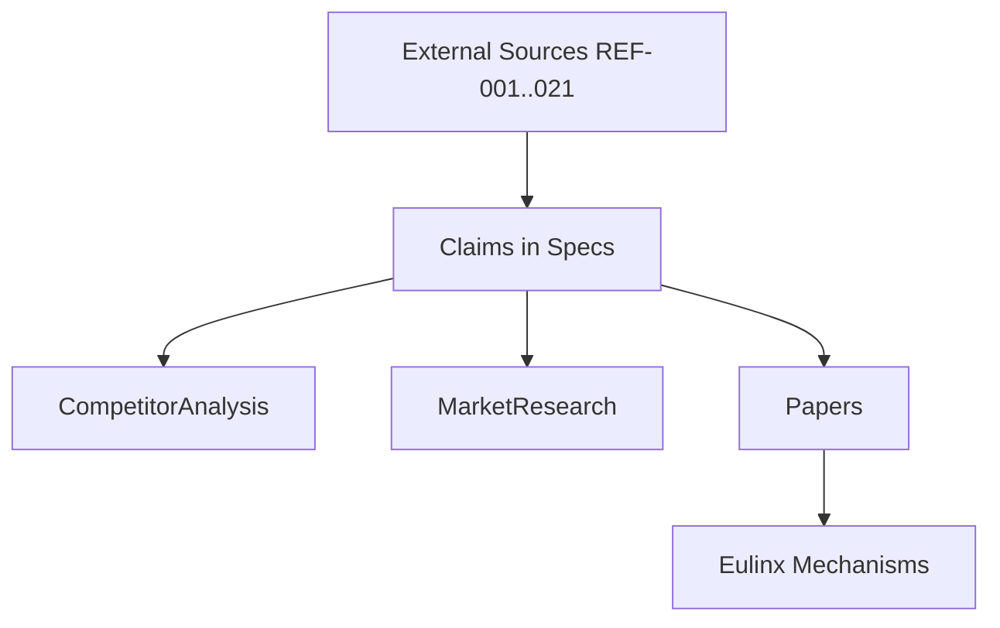

---
title: References Diagrams
status: draft
version: 1.0
tags:
  - research
  - diagrams
  - references
related:
  - "[[References-Part01]]"
---

# References Diagrams



```text
Citation flow:
  REF-xxx (fact)
     -> Research note (fact + interpretation)
          -> Specification (requirement)
               -> Roadmap / AI System
```

# Reference Type Breakdown

```text
Reports    : REF-001, REF-002, REF-007
Papers     : REF-003, REF-004, REF-005, REF-006, REF-008
Frameworks : REF-009, REF-010, REF-011, REF-012
Standards  : REF-015, REF-016, REF-017, REF-018
Tools      : REF-019, REF-020, REF-021
Datasets   : REF-013, REF-014 (pending selection)
```

# Related Documents

- [[References-Part01]]
- [[References-Part02]]
- [[Papers-Part01]]
