# AIChecklist Diagrams

```mermaid
flowchart LR
  subgraph BEFORE["Before you code"]
    B1["Read relevant spec Part"]
    B2["Know owning layer<br/>UI/Services/IPC/Rust"]
    B3["Small task + acceptance"]
    B4["Check ImplementationOrder"]
    B5["Know state owner<br/>Zustand/TanStack"]
  end
  subgraph WHILE["While coding"]
    W1["invoke via service"]
    W2["Logic in service/store"]
    W3["listen + unlisten"]
    W4["Design tokens only"]
    W5["Rust = native OS work"]
    W6["No optimistic state"]
  end
  subgraph AFTER["After coding"]
    A1["Write/update test"]
    A2["Sync vault spec"]
    A3["No secret commits"]
    A4["Lint + prettier + typecheck"]
    A5["Avoid CommonMistakes"]
  end
  BEFORE --> WHILE --> AFTER
  AFTER -->|"any item fails"| STOP["STOP & resolve"]
  WHILE -->|"any item fails"| STOP
```



```text
CHECKLIST GATE (run before every task)

BEFORE
  read spec Part ............ [ ]
  identify owning layer ..... [ ]  UI / Services / IPC / Rust
  small + verifiable ........ [ ]  explicit acceptance
  check ImplementationOrder . [ ]  no skipped deps
  authoritative state owner . [ ]  Zustand / TanStack Query
        |
WHILE  (any fail -> STOP)
  invoke via service ........ [ ]
  logic out of component .... [ ]
  listen + unlisten ......... [ ]
  design tokens only ........ [ ]
  Rust = native OS only ..... [ ]
  no optimistic runtime state [ ]
        |
AFTER  (any fail -> STOP)
  test added/updated ........ [ ]
  vault spec synced ......... [ ]
  no secrets committed ...... [ ]
  lint/prettier/typecheck ... [ ]
  no CommonMistakes ......... [ ]
```

# Related Documents

- [[AIChecklist-Part01]]
- [[06-workflow-engine/README]]
- [[07-ui-ux/README]]
- [[04-memory/README]]
- [[12-development/README]]
