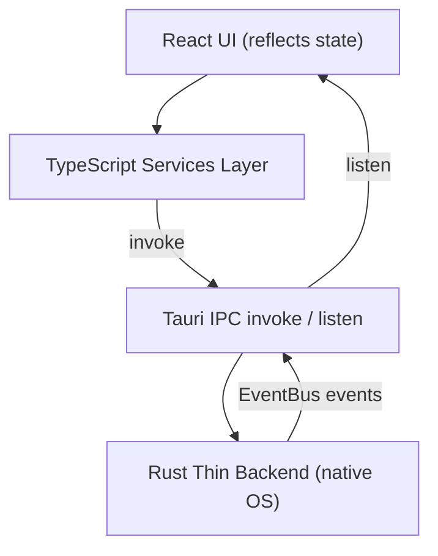
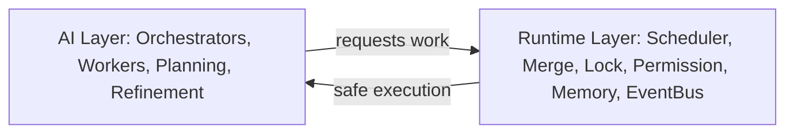
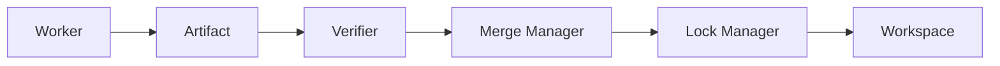

---
title: ArchitectureSummary Diagrams
status: draft
version: 1.0
tags:
  - ai-context
  - architecture
  - diagrams
  - Eulinx
related:
  - "[[99-ai-context/ArchitectureSummary/ArchitectureSummary-Part01]]"
  - "[[99-ai-context/ArchitectureSummary/ArchitectureSummary-Part05]]"
---

# ArchitectureSummary Diagrams

## Overall Layered Architecture



```text
UI (React)
  -> Services (TS)
    -> invoke -> Rust (thin)
  <- listen <- EventBus
```

## AI vs Runtime Separation



```text
AI Layer  (reasons, plans, critiques)
Runtime Layer (deterministic: schedule, lock, merge, enforce)
```

## Worker Hierarchy

```text
User
  -> Root Orchestrator
    -> Phase Orchestrators
      -> Task Orchestrators
        -> Workers
          -> Tools -> Artifacts
```

## Artifact / Merge Flow



```text
Worker -> Artifact -> Verifier -> Merge Manager -> Lock Manager -> Workspace
```

## EventBus

```text
Publishers: Workers, Terminals, Workflows, Plugins, Runtime Services
Channel:    EventBus (publish / subscribe)
Subscribers: UI (listen), Plugins, Runtime Services
```

## Related Documents

- [[99-ai-context/ArchitectureSummary/ArchitectureSummary-Part01]]
- [[99-ai-context/ArchitectureSummary/ArchitectureSummary-Part05]]
- [[02-runtime/README]]
