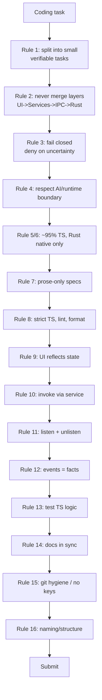

# CodingRules Diagrams



```text
CODING RULES FLOW  (each rule = a gate)

PART 01  tasks & layering
  R1 small verifiable tasks
  R2 no merged layers : UI -> Services(TS) -> IPC -> Rust(thin)
  R3 fail closed       : deny on uncertain permission/lock/budget
  R4 AI/runtime boundary : runtime deterministic, no LLM

PART 02  language & docs
  R5 ~95% TypeScript
  R6 Rust = native OS only (PTY/fs/window/secure-store/dialogs)
  R7 specs prose-only, no fenced code
  R8 strict TS + ESLint + Prettier + absolute imports

PART 03  state & events
  R9  UI reflects state (Zustand + TanStack Query)
  R10 invoke only via a service
  R11 every listen has an unlisten
  R12 events = facts; invoke = commands

PART 04  quality
  R13 unit/integration tests for services/stores/utils
  R14 keep vault docs in sync with behavior
  R15 small commits, never secrets/keys
  R16 feature folders, centralized shared types
```

# Related Documents

- [[CodingRules-Part01]]
- [[06-workflow-engine/README]]
- [[07-ui-ux/README]]
- [[04-memory/README]]
- [[12-development/README]]
