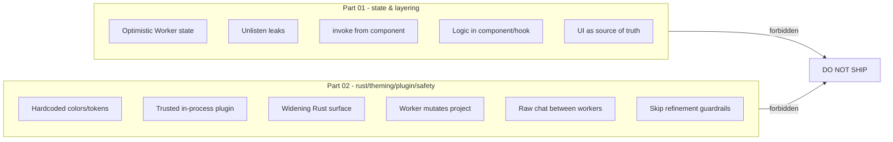

# CommonMistakes Diagrams



```text
ANTI-PATTERN MAP  (all forbidden for the cheap model)

PART 01  state & layering
  M1 optimistic runtime state .... wait for EventBus truth
  M2 unlisten leaks .............. pair every listen w/ unlisten
  M3 invoke from component ....... go through a service
  M4 business logic in view ...... push to service/store
  M5 UI as source of truth ...... Zustand + TanStack Query

PART 02  rust / theming / plugin / safety
  M6 hardcoded hex/spacing ....... design tokens only
  M7 trusted in-process plugin ... isolate + permission gate
  M8 widening Rust surface ....... Rust stays native bridge
  M9 worker mutates project ...... produce Artifact, MergeManager applies
  M10 raw chat between workers ... exchange Artifacts + scoped RunContext
  M11 skip refinement guardrails . stopping rule + budget + honest UX
```

# Related Documents

- [[CommonMistakes-Part01]]
- [[06-workflow-engine/README]]
- [[07-ui-ux/README]]
- [[04-memory/README]]
- [[12-development/README]]
