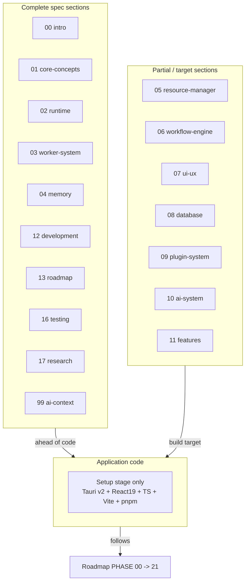

# CurrentProgress Diagrams



```text
VAULT COMPLETION MAP

COMPLETE (written, prefer over summary)
  00 introduction        12 development (constitution)
  01 core-concepts       13 roadmap (MVP + P1-4 + Future)
  02 runtime             16 testing
  03 worker-system       17 research
  04 memory              99 ai-context (this set)

PARTIAL / TARGET (structure declared, build target)
  05 resource-manager  [complete: CPU/mem, disk/net, token/cost, quotas, monitoring]
  06 workflow-engine   [structure declared]
  07 ui-ux             [structure declared]
  08 database          [structure declared]
  09 plugin-system     [structure declared]
  10 ai-system         [structure declared]
  11 features          [README present]

CODE REALITY
  project-setup stage only  -> vault is well ahead of code
  implementation follows roadmap phases PHASE 00 -> 21
```

# Related Documents

- [[CurrentProgress-Part01]]
- [[06-workflow-engine/README]]
- [[07-ui-ux/README]]
- [[04-memory/README]]
- [[12-development/README]]
