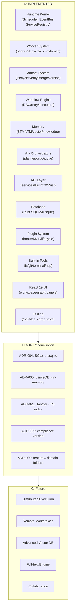

# CurrentProgress Diagrams



```text
COMPLETION MAP

✅ RUNTIME KERNEL      — Scheduler, EventBus, services, lifecycle
✅ WORKER SYSTEM       — Spawn, lifecycle, hierarchy, comm, health
✅ ARTIFACT SYSTEM     — Lifecycle, verify, merge, version, relationships
✅ WORKFLOW ENGINE     — DAG, retry, node executors, pause/resume
✅ MEMORY SYSTEM       — STM/LTM/vector/knowledge+embeddings
✅ AI / ORCHESTRATORS  — Planner, critic, judge, refinement loop
✅ API LAYER           — Service modules, Eulinx:// URIs, Rust bridge
✅ DATABASE (Rust)     — SQLite/rusqlite, migrations, CRUD, backups
✅ PLUGIN SYSTEM       — Hooks, MCP client, lifecycle, tool registry
✅ BUILT-IN TOOLS      — FS, Git, terminal, HTTP, browser, DB
✅ UI                  — Workspace, node-graph, panels, themes, a11y
✅ TESTING             — 128 Vitest files + cargo tests + E2E scaffold

🔄 ADR RECONCILIATION  — In progress (004/005/021/025/029 done)

📋 DEFERRED           — Distributed execution, marketplace, LanceDB, Tantivy, collab
```

# Related Documents

- [[CurrentProgress-Part01]]
- [[ProjectState/ProjectState-Part01]]
- [[ImplementationGapAudit]]
