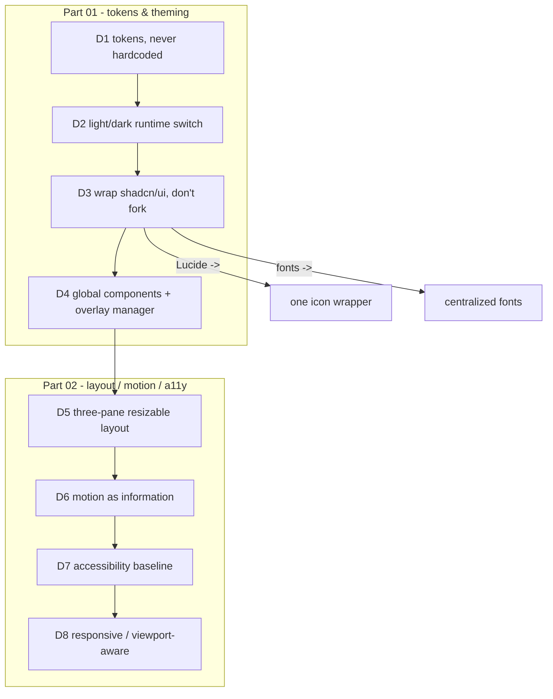

# DesignRules Diagrams



```text
DESIGN RULES  (inherit from 07-ui-ux)

PART 01  tokens & theming
  D1  token-driven, NO hardcoded color/spacing/typography
  D2  light + dark at runtime; calm dark default + one accent
  D3  Tailwind + shadcn/ui WRAPPED; Lucide via one icon component
  D4  global wrappers for ~25 primitives; one overlay manager
        (dialog/dropdown/menu/tooltip/popover/context/bottom-sheet)

PART 02  layout / motion / a11y / responsive
  D5  three-pane resizable: nav | canvas | context
  D6  motion = feedback/observability, not decoration; reduced-motion
  D7  a11y baseline: focus, ARIA, keyboard, high-contrast
  D8  overlays do collision detection; virtualize long lists
```

# Related Documents

- [[DesignRules-Part01]]
- [[06-workflow-engine/README]]
- [[07-ui-ux/README]]
- [[04-memory/README]]
- [[12-development/README]]
