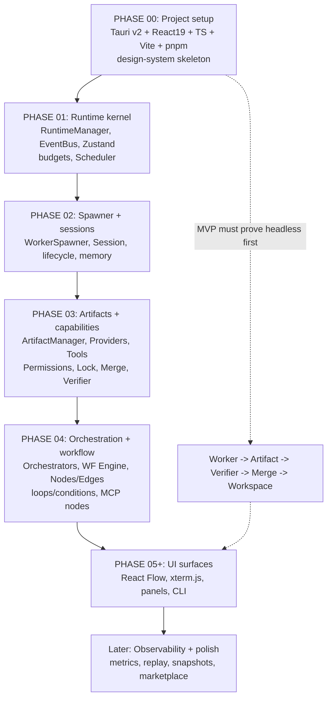

# ImplementationOrder Diagrams



```text
DEPENDENCY ORDER  (later phase starts only after prereqs tested)

P00  project setup ........ Tauri/React/TS/Vite/pnpm + design skeleton
  |
P01  runtime kernel ........ RuntimeManager, EventBus, Zustand, budgets, Scheduler
  |
P02  spawner + sessions .... WorkerSpawner, Session, lifecycle, basic memory
  |
P03  artifacts + caps ..... ArtifactManager, Providers, Tools, Permissions, Lock, Merge, Verifier
  |
P04  orchestration + WF ... Orchestrators, WF Engine, Node/Edge, loops, MCP nodes
  |
P05+ UI surfaces .......... React Flow, xterm.js, panels, animations, CLI
  |
LATER observability+polish  metrics, notifications, KB, replay, snapshots, marketplace

MVP FIRST: prove headless core loop before any UI
  Worker spawns -> Artifact -> Verifier -> MergeManager -> Workspace
```

# Related Documents

- [[ImplementationOrder-Part01]]
- [[06-workflow-engine/README]]
- [[07-ui-ux/README]]
- [[04-memory/README]]
- [[12-development/README]]
