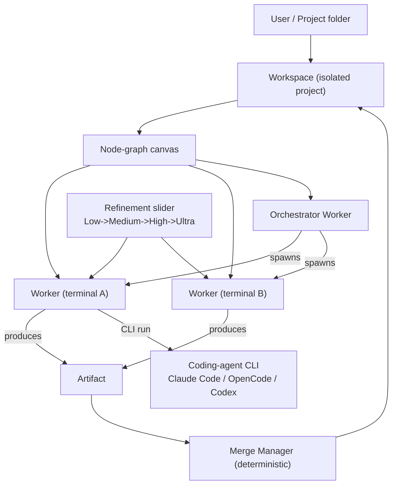

---
title: ProjectOverview Diagrams
status: draft
version: 1.0
tags: [ai-context, diagrams]
related: ["[[ProjectOverview-Part01]]"]
---

# ProjectOverview Diagrams



```text
Eulinx = local-first desktop OS for AI work

USER points Eulinx at a project folder
        |
WORKSPACE  (isolated, project-scoped)
        |
NODE-GRAPH CANVAS  (center of the product)
   Orchestrator Worker --spawns--> Worker A (real PTY terminal)
                       --spawns--> Worker B (real PTY terminal)
   each Worker runs a CLI, produces an Artifact
        |
ARTIFACT -> Verifier -> Merge Manager (deterministic) -> Workspace
        |
REFINEMENT SLIDER  Low/Med/High/Ultra  (critique->refine passes)
        |
DIFFERENTIATORS
  visual multi-agent, local-first
  refinement slider
  live animated data-flow = observability
  real terminals (Rust PTY)
  MCP as capability surface
  privacy / no lock-in / BYOK / export JSON
```

# Related Documents

- [[ProjectOverview-Part01]]
- [[06-workflow-engine/README]]
- [[07-ui-ux/README]]
- [[04-memory/README]]
- [[12-development/README]]
