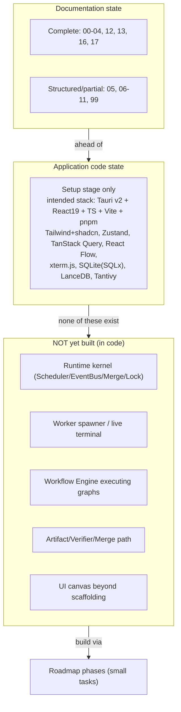

# ProjectState Diagrams



```text
CURRENT BUILD STATE

DOCUMENTATION  (single source of truth, ahead of code)
  complete : 00-04, 12, 13, 16, 17
  partial  : 05, 06-11, 99

APPLICATION CODE
  setup stage only
  stack: Tauri v2 / React 19 / TS / Vite / pnpm
         Tailwind+shadcn, Zustand, TanStack Query
         React Flow, xterm.js, SQLite(SQLx), LanceDB, Tantivy
  first targets: design-system skeleton + thin Rust PTY bridge

NOT YET BUILT (do not assume existence)
  runtime kernel (Scheduler, EventBus, MergeManager, LockManager)
  worker spawner / live terminal execution
  workflow engine executing graphs
  artifact/verifier/merge path
  UI canvas beyond scaffolding

CONSEQUENCE: prove headless loop before UI; keep Rust thin
```

# Related Documents

- [[ProjectState-Part01]]
- [[06-workflow-engine/README]]
- [[07-ui-ux/README]]
- [[04-memory/README]]
- [[12-development/README]]
