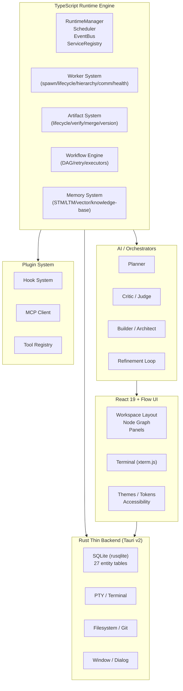

# ProjectState Diagrams



```text
ARCHITECTURE OVERVIEW

LAYER                    STATUS           KEY FILES
─────────────────────────────────────────────────────
TypeScript Runtime       ✅ IMPLEMENTED   runtime/, scheduler/, event-bus/
Worker System            ✅ IMPLEMENTED   spawner/, worker/
Artifact System           ✅ IMPLEMENTED   artifact/
Workflow Engine          ✅ IMPLEMENTED   workflow/
Memory System            ✅ IMPLEMENTED   memory/
AI / Orchestrators       ✅ IMPLEMENTED   orchestrator/, roles/
API Layer                ✅ IMPLEMENTED   api/services/
Database (Rust SQLite)   ✅ IMPLEMENTED   src-tauri/src/managers/db_manager.rs
Plugin System            ✅ IMPLEMENTED   plugins/
Built-in Tools           ✅ IMPLEMENTED   tools/
UI                       ✅ IMPLEMENTED   ui/
Testing                  ✅ IMPLEMENTED   128 test files, cargo tests

DEFERRED TO FUTURE:
  - Distributed execution
  - Remote marketplace
  - Advanced vector DB (LanceDB)
  - Full-text engine (Tantivy)
  - Collaboration features
```

# Related Documents

- [[ProjectState-Part01]]
- [[CurrentProgress/CurrentProgress-Part01]]
- [[ImplementationGapAudit]]
