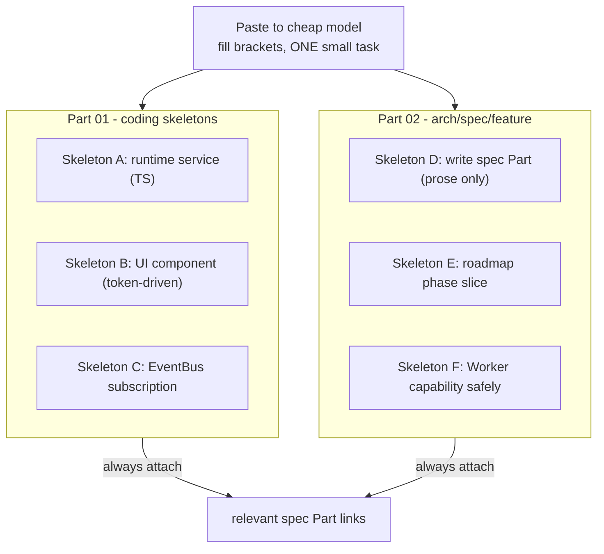

# PromptTemplates Diagrams



```text
PROMPT TEMPLATE CATALOG  (reusable skeletons for the cheap model)

PART 01  coding-task skeletons
  A  implement a runtime service (TypeScript only, deterministic)
  B  implement a UI component (token-driven, shadcn wrapper)
  C  wire an EventBus subscription (listen + unlisten, no optimistic)

PART 02  architecture / spec / feature skeletons
  D  write/extend a spec Part (prose-only, NO-CODE rule)
  E  implement a roadmap phase slice (small, deps pinned)
  F  build a Worker capability safely (ToolRegistry + PermissionManager)

RULE FOR ALL: ONE small verifiable task per prompt
             always attach spec Part links as context
```

# Related Documents

- [[PromptTemplates-Part01]]
- [[06-workflow-engine/README]]
- [[07-ui-ux/README]]
- [[04-memory/README]]
- [[12-development/README]]
