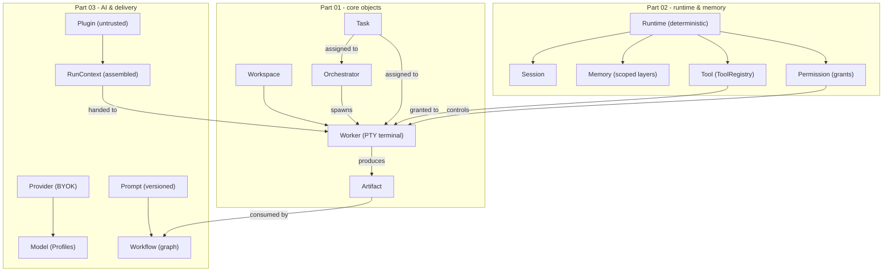

# Terminology Diagrams



```text
CONCEPT MAP  (nouns every AI must know)

PART 01  core objects
  Workspace -> Worker (Rust PTY terminal) -> Artifact
  Orchestrator plans/splits; spawns Workers
  Task = first-class unit, assigned to Worker/Orchestrator

PART 02  runtime & memory
  Runtime = deterministic layer (exec/schedule/lock/merge/perms/events)
  Session = bounded interaction (terminal/agent)
  Memory = scoped layers (Workspace/Project/Session/.../Vector/KB/Replay)
  Tool = capability via ToolRegistry
  Permission = explicit grant set (fail-closed, human gates)

PART 03  AI & delivery
  Provider (BYOK, keys in OS secure store) -> Model (Profiles)
  Prompt (versioned, drives refinement loop)
  Workflow = graph of Nodes/Edges (Engine executes it)
  Plugin = untrusted, isolated, permission-gated
  RunContext = task + channels + Artifacts + scoped memory + tools + perms
```

# Related Documents

- [[Terminology-Part01]]
- [[06-workflow-engine/README]]
- [[07-ui-ux/README]]
- [[04-memory/README]]
- [[12-development/README]]
